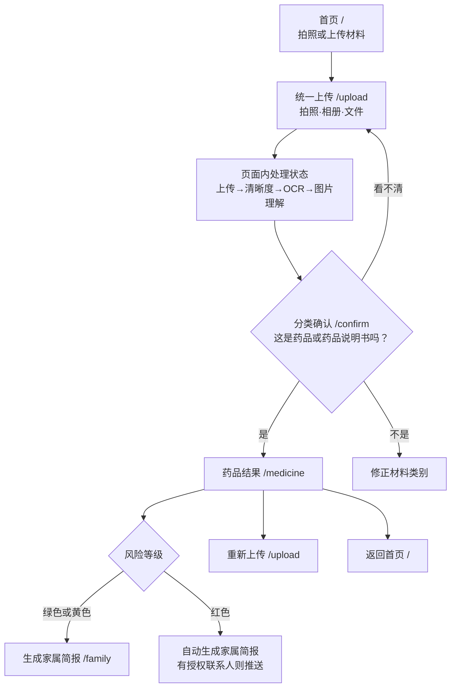
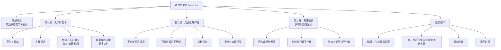

# 药品UI架构图

> 依据：成员A《产品UI与网页前端执行手册》及《用户任务与需求&信息架构与页面流程》。

## 一、药品识别主流程



## 二、药品结果页信息层级



## 三、药品结果页移动端线框

```text
┌────────────────────────────┐
│  ← 返回          药品结果  │
├────────────────────────────┤
│  ● 信息已核对              │
│  请先看看药名和规格对不对  │
├────────────────────────────┤
│  药品名称                  │
│  阿司匹林肠溶片            │
│  规格：示例规格            │
├────────────────────────────┤
│  这个药是做什么的          │
│  简短说明，最多两三行      │
├────────────────────────────┤
│  材料上写的是              │
│  每次：—  每天：—          │
│  时间：—                   │
│  请按医生交代的方法使用    │
├────────────────────────────┤
│  请注意                    │
│  ① 一条重要提醒            │
│  ② 一条重要提醒            │
├────────────────────────────┤
│  [ 查看详细信息 ︾ ]        │
├────────────────────────────┤
│  需要您确认（有问题才显示）│
│  一次只提示最重要的一项    │
├────────────────────────────┤
│  绿/黄：[生成家属简报]     │
│  红：已推送/待绑定/失败    │
│  重新上传      返回首页    │
└────────────────────────────┘
```

## 四、显示约束

- 手机端单栏；电脑端可将大字用药卡与来源图片区并排展示。
- 首屏不出现长表格、完整说明书原文或成串编码。
- 大字用药卡最多包含四个内容块，每块默认不超过三行。
- 说明书长内容折叠展示；表格在手机端转换为卡片。
- 同一页面只有一个醒目的主按钮。
- 待确认问题不存在时，整个模块隐藏。
- 风险或核对状态不能只用颜色表达，必须同时显示文字和图标。
