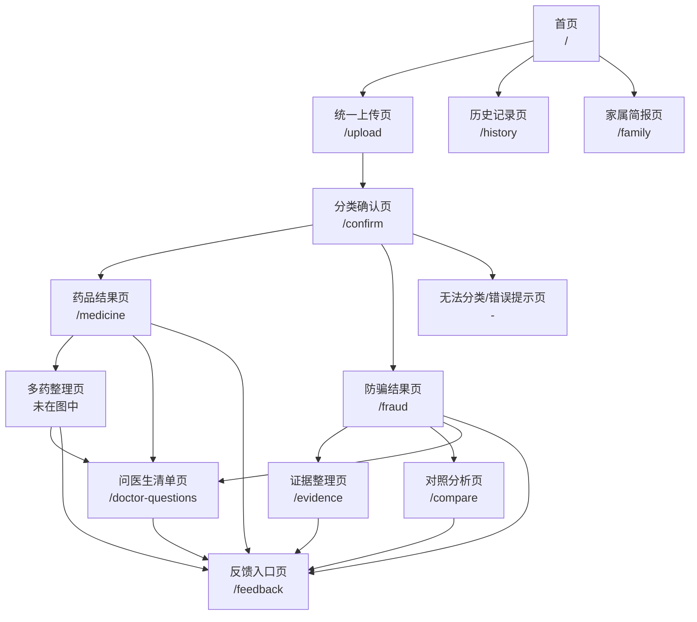

# 用户任务与需求 & 信息架构与页面流程


## 一、用户任务与需求

### 1.1 目标用户画像

| 用户角色 | 核心特征 | 使用场景 | 核心痛点 |
|---|---|---|---|
| **老年人（主用户）** | 60岁以上，视力退化，对智能设备操作不熟练，健康焦虑高 | 独自在家收到药品/保健品，需要看懂说明；接到推销电话或收到宣传单 | 说明书字太小、术语看不懂；分不清药品和保健品；容易被"特效""治愈"话术诱导 |
| **子女/家庭照护者** | 30-50岁，工作繁忙，与老人分居或同城不同住 | 老人转发推销信息让其判断；定期查看老人用药情况 | 不知道老人接触了什么产品；老人说不清对方要求；担心老人已经付款或泄露信息 |
| **医生/药师（沟通场景）** | 社区医院或药房专业人员 | 老人带着系统生成的材料来咨询 | 老人描述不清用药史；缺乏结构化的问题清单和证据材料 |

---

### 1.2 用户任务清单

#### 角色一：老年人

| 任务编号 | 用户任务 | 任务描述 | 对应功能 | 中期优先级 |
|---|---|---|---|---|
| U-ELD-01 | 上传药品材料 | 拍摄药盒、说明书、处方单，上传至系统 | 功能一：统一上传与分类 | **√** |
| U-ELD-02 | 确认材料分类 | 查看系统对上传材料的分类结果，确认或修正 | 功能一：统一上传与分类 | **√** |
| U-ELD-03 | 查看大字版药品说明 | 查看系统生成的通俗版用药卡，包含用法、用量、注意事项 | 功能二：大字版药品说明 | **√** |
| U-ELD-04 | 查看风险等级与警告 | 查看系统对材料的风险判定（绿/黄/红），阅读关键警告 | 功能八：三级风险机制 | **√** |
| U-ELD-05 | 上传保健品/宣传材料 | 拍摄保健品广告、宣传单、微信截图等并上传 | 功能一：统一上传与分类 | **√** |
| U-ELD-06 | 查看防骗分析结果 | 了解为什么这个材料有风险，现在应该停止什么操作 | 功能四：健康消费防骗分析 | **√** |
| U-ELD-07 | 听取语音播报 | 让系统朗读药品说明或风险警告（视技术实现） | 功能十：适老化与无障碍 |   |
| U-ELD-08 | 删除已上传记录 | 主动删除历史分析记录，保护隐私 | 功能十一：历史记录与隐私控制 |   |
| U-ELD-09 | 修改错误分类 | 当系统分类错误时，手动更正材料类型 | 功能一：统一上传与分类 | **√** |
| U-ELD-10 | 核验药品批准文号 | 查看系统对药品批准文号的核验结果，判断药品身份是否可信 | 功能二：大字版药品说明 + 功能四：健康消费防骗分析 | **√** |

#### 角色二：子女/家庭照护者

| 任务编号 | 用户任务 | 任务描述 | 对应功能 | 中期优先级 |
|---|---|---|---|---|
| U-FAM-01 | 代老人上传材料 | 帮老人上传药品或推销材料，查看分析结果 | 功能一：统一上传与分类 | **√** |
| U-FAM-02 | 上传聊天/付款记录 | 上传微信聊天截图、转账记录、订单凭证 | 功能一：统一上传与分类 | **√** |
| U-FAM-03 | 生成并查看家属简报 | 查看系统生成的结构化简报，了解老人接触了什么、是否付款、风险等级 | 功能七：家属简报 | **○** |
| U-FAM-04 | 转发家属简报 | 将简报通过微信等方式转发给其他家庭成员 | 功能七：家属简报 | **○** |
| U-FAM-05 | 查看证据整理 | 查看系统整理的事件时间线、销售主体、付款金额、对方承诺 | 功能九：订单与证据整理 |   |
| U-FAM-06 | 查看历史记录 | 查看老人过往上传的材料和分析结果 | 功能十一：历史记录与隐私控制 |   |

#### 角色三：医生/药师（沟通场景）

| 任务编号 | 用户任务 | 任务描述 | 对应功能 | 中期优先级 |
|---|---|---|---|---|
| U-DOC-01 | 查看药品清单 | 查看老人当前服用药品的结构化列表 | 功能二：大字版药品说明 | **√** |
| U-DOC-02 | 查看处方与说明书差异 | 查看系统标记的处方与说明书不一致之处 | 功能二：大字版药品说明 | **√** |
| U-DOC-03 | 查看问医生清单 | 查看系统生成的需要专业人员回答的问题列表 | 功能六：一键生成问医生清单 |   |
| U-DOC-04 | 查看推销产品材料 | 查看老人上传的保健品宣传材料及风险分析 | 功能四：健康消费防骗分析 | **√** |
| U-DOC-05 | 查看药品真实性核验结果 | 查看药品批准文号、生产企业、规格剂型与官方备案是否一致 | 功能二：大字版药品说明 | **√** |

---

### 1.3 功能需求优先级

根据项目统筹规划，中期检查前功能优先级如下：

| 优先级 | 功能模块 | 需求说明 | 验收标准 |
|---|---|---|---|
| **P0-必须做** | 功能一：统一上传与分类 | 支持图片上传、OCR识别、材料自动分类、用户确认分类 | 上传成功、分类正确、可手动修正 |
| **P0-必须做** | 功能二：大字版药品说明 | 提取药品名称、用法、用量、注意事项，生成老人友好的大字版用药卡 | 信息准确、不臆测剂量、区分材料原文与知识库补充 |
| **P0-必须做** | 功能四：健康消费防骗分析 | 识别身份风险、宣传风险、交易风险、情绪操控风险，输出风险等级和证据 | 每条风险有原文证据、有行动建议 |
| **P0-必须做** | 功能八：三级风险机制 | 绿色（信息解释）、黄色（需要核验）、红色（立即停止）贯穿所有输出 | 风险等级判定准确、红色风险优先展示行动提示 |
| **P1-尽量做** | 功能七：家属简报 | 整合药品结果、风险结果、付款信息，生成结构化家属版摘要；红色风险时自动推送，绿/黄时由用户选择 | 简报内容完整、自动推送需授权联系方式 |
| **P1-尽量做** | 功能十一：历史记录与隐私控制 | 在首页提供独立历史记录入口，支持查看、筛选、导出和删除已保存记录 | 入口独立、删除可撤销、隐私最小化 |
| **P2-暂不做** | 功能三、五、六、九、十、十二 | 多药整理、药品与保健品对照、问医生清单、证据整理、适老化语音、反馈入口 | 中期后迭代 |

---

### 1.4 非功能需求

| 需求项 | 描述 | 影响范围 |
|---|---|---|
| 适老化设计 | 正文字号不小于18px，主按钮高度不小于56px，点击区域充足，高对比度配色 | 所有页面 |
| 响应式布局 | 支持手机（主）、平板、电脑访问，手机端单栏布局，电脑端双栏 | 所有页面 |
| 一屏一任务 | 每个页面只呈现一个核心任务，避免信息过载 | 所有页面 |
| 风险置顶 | 红色/黄色风险警告必须置于页面顶部，不可折叠 | 结果页 |
| 多模态表达 | 风险不能仅通过颜色表达，必须配合图标+文字 | 所有页面 |
| 横向滚动禁止 | 手机端不允许出现横向滚动条 | 所有页面 |
| 错误可撤销 | 关键操作（如删除）需二次确认，支持返回上一步 | 上传流程、历史记录 |
| 隐私最小化 | 默认保存上传材料，敏感信息需授权展示；红色风险时自动生成并推送家属简报，绿/黄时由用户选择生成 | 上传页、结果页 |

---

## 二、信息架构

### 2.1 站点地图

```
银龄安心网页应用
│
├── 首页 (/)
│   ├── 主入口：拍照/上传材料
│   ├── 次入口：查看历史记录 → 跳转 /history
│   ├── 次入口：请家里人一起看
│   ├── 功能简介（3句话）
│   └── 隐私提醒
│
├── 统一上传 (/upload) 【中期必须做】
│   ├── 选择文件（拍照/相册/文件）
│   ├── 图片预览与裁剪
│   ├── 隐私遮挡提示（如检测到敏感信息）
│   ├── 上传中状态
│   ├── OCR识别中状态
│   └── 分析中状态
│
├── 分类确认 (/confirm) 【中期必须做】
│   ├── 系统分类结果展示
│   ├── 置信度提示（高/中/低）
│   ├── 用户确认按钮
│   ├── 分类修正选项（正规药品/保健品/宣传材料/聊天截图/订单凭证/无法判断）
│   └── 重新上传入口
│
├── 药品结果 (/medicine) 【中期必须做】
│   ├── 风险等级标识（绿/黄/红）
│   ├── 大字版用药卡
│   │   ├── 药名与规格
│   │   ├── 主要用途
│   │   ├── 每次用量（材料原文）
│   │   ├── 每日次数（材料原文）
│   │   ├── 服用时间（饭前/饭后/睡前……）
│   │   ├── 重要注意事项
│   │   ├── 禁忌
│   │   └── 储存要求
│   ├── 药品真实性核验
│   │   ├── 批准文号识别（国药准字 H/Z/SXXXXXXXX）
│   │   ├── 批准文号是否存在
│   │   ├── 药品名称是否匹配
│   │   ├── 生产企业是否匹配
│   │   └── 规格/剂型是否匹配
│   ├── 信息来源标注（材料原文 vs 知识库）
│   ├── 需要确认的问题（如药名模糊）
│   └── 生成/自动推送家属简报入口（绿/黄时用户点击生成，红色时自动生成并推送）
│
├── 防骗结果 (/fraud) 【中期必须做】
│   ├── 风险等级标识（绿/黄/红）
│   ├── 立即操作提示（红色时置顶）
│   ├── 关键风险证据（最多3条）
│   ├── 详细风险分析
│   │   ├── 身份风险
│   │   ├── 宣传风险
│   │   ├── 交易风险
│   │   ├── 情绪操控风险
│   │   └── 产品真实性风险（假药/假冒产品/非法药品）
│   ├── 核验方式建议
│   ├── 证据保存提醒
│   └── 生成/自动推送家属简报入口（绿/黄时用户点击生成，红色时自动生成并推送）
│
├── 家属简报 (/family) 【中期尽量做】
│   ├── 老人上传材料摘要
│   ├── 涉及产品/销售人员
│   ├── 付款状态与金额
│   ├── 是否被要求停药
│   ├── 是否泄露个人信息
│   ├── 最高风险等级
│   ├── 风险原文证据
│   ├── 建议家属行动
│   ├── 导出/转发按钮
│   └── 打印优化样式
│
├── 对照分析 (/compare) 【暂不做】
│   ├── 正规药品信息
│   ├── 推销产品信息
│   ├── 对比表格
│   └── 替代治疗风险提示
│
├── 问医生清单 (/doctor-questions) 【暂不做】
│   ├── 自动生成问题列表
│   ├── 按优先级排序
│   └── 打印/导出功能
│
├── 证据整理 (/evidence) 【暂不做】
│   ├── 事件时间线
│   ├── 销售主体信息
│   ├── 付款记录汇总
│   ├── 对方承诺记录
│   └── 缺失证据提示
│
├── 历史记录 (/history) 【暂不做】
│   ├── 记录列表（按日期）
│   ├── 筛选功能（按材料类型/风险等级）
│   ├── 查看详情
│   ├── 导出功能
│   └── 删除功能
│
├── 反馈与复核 (/feedback) 【暂不做】
│   ├── 反馈类型选择
│   ├── 关联记录选择
│   ├── 问题描述输入
│   ├── 补充图片上传（可选）
│   ├── 提交确认
│   └── 提交成功提示
│
├── 隐私说明 (/privacy)
│   ├── 数据使用说明
│   ├── 保存与删除政策
│   └── 联系方式
│
└── 错误页与状态页
    ├── 模糊图片提示
    ├── OCR失败提示
    ├── 无法分类提示
    ├── 工作流超时提示
    ├── 空状态（无历史记录）
    └── 404/网络错误
```

### 2.2 页面清单与中期交付范围

| 页面 | 路由 | 中期状态 | 说明 |
|---|---|---|---|
| 首页 | / | **√** | 项目门面，包含上传主入口和历史记录独立入口 |
| 统一上传页 | /upload | **√** | 核心流程起点 |
| 分类确认页 | /confirm | **√** | 人机协同确认，降低误分类风险 |
| 药品结果页 | /medicine | **√** | 核心演示场景之一，支持药品批准文号真实性核验 |
| 防骗结果页 | /fraud | **√** | 核心演示场景之一 |
| 家属简报页 | /family | **○** | 亮点功能，体现"全家照护" |
| 对照页 | /compare |   | 功能五，中期后迭代 |
| 问医生清单 | /doctor-questions |   | 功能六，中期后迭代 |
| 证据整理页 | /evidence |   | 功能九，中期后迭代 |
| 历史记录页 | /history | **○** | 功能十一，在首页设有独立入口 |
| 反馈页 | /feedback |   | 功能十二，中期后迭代 |
| 隐私说明页 | /privacy | **√** | 合规与信任基础 |
| 错误页/状态页 | - | **√** | 覆盖核心异常流程 |

---

## 三、页面流程

### 核心流程总览



流程关系说明：

- **首页**是全局入口，可直接进入统一上传页、历史记录页和家属简报页；
- **历史记录页**和**家属简报页**与主分析流程平行，彼此独立，不再串联；
- **统一上传页 → 分类确认页 → 药品结果页/防骗结果页**构成核心分析流程；
- **多药整理页、问医生清单页**是药品结果页的延伸功能；**对照分析页、证据整理页**是防骗结果页的延伸功能；
- 四条延伸功能路径最终均汇入**反馈入口页**，作为全局反馈出口。

---

### 3.1 流程1：统一上传与分类（√）

**用户目标**：将手中的材料拍照上传，让系统知道这是什么。

**流程步骤**：

```
步骤1：首页
├── 用户看到主按钮"拍照或上传材料"
├── 可选次按钮"查看历史记录"（跳转历史记录页）
├── 可选次按钮"请家里人一起看"（跳转家属简报说明）
└── 点击主按钮 → 进入上传页

步骤2：上传页 (/upload)
├── 用户选择输入方式：拍照 / 相册选择 / 文件上传
├── 系统限制：仅接受图片格式（jpg/png），单张不超过10MB
├── 图片预览：显示裁剪框，建议用户对准文字区域
├── 隐私提示："上传的材料将默认保存，便于后续查看和家属协同"
├── 隐私信息检测（上传后自动识别身份证、银行卡、验证码、地址、电话等敏感信息）
│   ├── 未检测到敏感信息：进入步骤3
│   └── 检测到敏感信息：
│       ├── 高亮标记敏感区域
│       ├── 提示文案："检测到图片中可能包含身份证/银行卡/验证码等敏感信息，建议遮挡后重新拍摄"
│       ├── 按钮A："重新上传" → 返回步骤2重新选择图片
│       ├── 按钮B："我已确认，继续识别" → 进入步骤3（需用户明确授权）
│       └── 按钮C："取消上传" → 返回首页
└── 用户点击"开始识别" → 进入步骤3

步骤3：预处理状态（页面内转圈，不跳转）
├── 状态1：上传中...（进度条）
├── 状态2：检查清晰度...（如模糊提示重新拍摄）
├── 状态3：隐私信息复核...（再次确认是否包含身份证号、银行卡号、验证码、地址、电话等）
│   └── 若复核发现敏感信息且用户未授权，暂停并提示重新上传
├── 状态4：OCR识别中...（提取文字）
├── 状态5：图片理解中...（识别包装特征）
└── 完成后自动跳转步骤4

步骤4：分类确认页 (/confirm)
├── 展示系统分类结果："系统判断这是：[正规药品]"
├── 展示置信度：高/中/低
├── 分支A：用户点击"确认正确" → 进入对应结果页
├── 分支B：用户选择"这不是药品，这是..." → 修正分类
│   └── 选项：保健食品/健康宣传/推销聊天/订单凭证/医疗器械/无法判断
├── 分支C：用户点击"重新上传" → 返回步骤2
└── 低置信度时强制要求确认，不可跳过
```

**异常分支**：
- 文件过大 → 提示"图片太大，请压缩后重试"
- 非图片格式 → 提示"请上传照片"
- 图片模糊 → 提示"照片不够清晰，建议对准材料重新拍摄"
- 检测到隐私敏感信息（身份证、银行卡、验证码、地址、电话等） → 提示"检测到敏感信息，建议遮挡后重新拍摄，或确认后继续"
- OCR失败 → 提示"未能识别文字，请尝试调整光线后重拍"

---

### 3.2 流程2：药品解读（√）

**用户目标**：看懂手中的药品应该怎么吃，有什么要注意的。

**前置条件**：用户上传材料并确认分类为"正规药品"或"药品说明书"

**流程步骤**：

```
步骤1：进入药品结果页 (/medicine)
├── 顶部：风险等级标识（绿色=暂未发现明显风险）
├── 第一屏：大字版用药卡（核心信息）
│   ├── 药名：XXX（材料原文）
│   ├── 规格：XXX（材料原文）
│   ├── 用途：XXX（材料原文 + 知识库通俗解释）
│   ├── 每次吃：X片/粒（材料原文，如材料未提及则显示"材料未说明，请查看说明书或询问药师"）
│   ├── 每天吃：X次（材料原文）
│   ├── 什么时候吃：饭前/饭后/睡前（材料原文）
│   └── 重要提醒：XXX（如"服药期间避免饮酒"）
├── 第二屏：详细信息（点击展开）
│   ├── 禁忌：XXX
│   ├── 常见不良反应：XXX
│   ├── 储存要求：XXX
│   └── 信息来源标注："以上用量来自您上传的处方" / "以上说明来自药品知识库"
├── 第三屏：药品真实性核验
│   ├── 批准文号：XXX（OCR识别，如"国药准字H12345678"）
│   ├── 核验状态：
│   │   ├── 绿色：批准文号存在，且名称、生产企业、规格/剂型均匹配
│   │   ├── 黄色：批准文号暂未核验成功，或部分字段无法确认
│   │   └── 红色：批准文号对应其他药品，或名称/厂家/规格不一致
│   ├── 核验结果展示：
│   │   ├── 包装显示：某某降压神药 / 国药准字H12345678 / XX制药厂 / 10mg×30片
│   │   └── 官方备案：某普通感冒药 / 国药准字H12345678 / YY药业 / 5mg×20片
│   ├── 风险提示（黄色）："该药品批准文号暂未核验成功，建议通过正规渠道查询"
│   ├── 风险提示（红色）："包装显示的批准文号对应其他药品，产品信息存在不一致风险"
│   └── 建议行动：暂停使用、保留包装、咨询正规医院或药师
├── 第四屏：需要确认的问题（如存在）
│   ├── "药名识别模糊，请确认是否为'XXX'？"
│   └── "处方与说明书服用时间不一致，请以医生处方为准"
├── 第五屏：医生补充说明
│   ├── 输入框标题："医生有没有额外嘱咐？"
│   ├── 输入框提示："如医生说的吃法、用量和说明书不一样，请在这里补充"
│   ├── 用户可输入文字（如"医生让早晚各1片，但说明书写的每日1片"）
│   ├── 系统对比输入内容与说明书/处方后给出提示：
│   │   └── "您输入的医生说明与现有材料不一致，请以医生当面嘱咐为准，必要时可咨询药师"
│   └── 该补充说明可同步到家属简报和问医生清单
└── 底部按钮：
    ├── "生成家属简报"（绿/黄时显示；红色时自动生成并推送）→ 跳转 /family
    ├── "重新上传" → 返回 /upload
    └── "返回首页" → 返回 /

约束：
- 若材料中未提及剂量，绝不根据常识补全
- 若药名或规格不清楚，提示"请重新拍摄或手动输入"，不继续推断
- 不出现"建议停药/换药/改量"等医疗建议
- 处方与说明书不一致时，明确提示"以医生处方为准"
- 药品真实性核验仅作为辅助参考，系统不直接判定"这是假药"，只提示"发现信息不一致，建议通过官方渠道进一步核验"
```

---

### 3.3 流程3：多药整理

**用户目标**：同时管理多种药品，避免吃错、重复或时间冲突。

**前置条件**：用户已上传两种及以上药品材料，或从药品结果页点击"我还有其他药品"

**流程步骤**：

```
步骤1：进入多药整理页 (/multi-medicine)
├── 顶部：已整理药品数量（"已整理3种药品"）
├── 第一屏：服用时间线表格（手机端转为卡片）
│   ├── 时间轴：早餐后 / 午餐前 / 晚餐后 / 睡前
│   ├── 每个时间点卡片：
│   │   ├── 药品名称
│   │   ├── 材料中记录的用量
│   │   ├── 来源（医院处方/药品说明书/药盒）
│   │   └── 提醒标签（按处方使用/询问药师/注意头晕）
│   └── 电脑端展示为表格，手机端展示为垂直时间轴卡片
├── 第二屏：系统提醒（黄色/红色警告）
│   ├── "药品A与药品B成分疑似相同，注意重复"
│   ├── "药品C与药品D名称相似，注意拿错"
│   ├── "药品E处方写每日2次，说明书写每日3次，请以处方为准"
│   └── "药品F材料缺少服用时间，请补充确认"
├── 第三屏：问药师清单预览
│   ├── "我现在服用的药是否存在疑似重复成分？"
│   ├── "处方和说明书的服用时间不同，应以哪个为准？"
│   └── "这款保健品能否与现有药品一起使用？"
├── 第四屏：操作入口
│   ├── "生成完整问医生清单" → 跳转 /doctor-questions
│   ├── "生成家属简报"（绿/黄时显示；红色时自动生成并推送）→ 跳转 /family
│   ├── "继续上传药品" → 返回 /upload
│   └── "导出用药时间表" → 生成图片/PDF
└── 底部按钮：返回首页 / 重新上传

约束：
- 系统只提示疑似问题，不直接要求删除某种药或更改剂量
- 所有提醒必须标注信息来源（哪张材料触发的提醒）
- 时间线必须基于用户材料原文，不臆测服用时间
```

---

### 3.4 流程4：健康消费防骗分析（√）

**用户目标**：判断收到的保健品宣传是否可信，现在应该停止什么操作。

**前置条件**：用户上传材料并确认分类为"健康宣传/推销聊天/订单凭证/保健食品/医疗器械"

**流程步骤**：

```
步骤1：进入防骗结果页 (/fraud)
├── 顶部：风险等级标识（红/黄/绿）
│   └── 若为红色，置顶显示立即行动（大字+图标，不可折叠）：
│       "先别付款" / "不要提供验证码" / "不要停掉现在吃的药" / "请让家里人一起看"
├── 第一屏：关键风险证据（最多3条，大字展示，每条包含）
│   ├── 证据原文引用："对方说'可以替代降压药'"
│   ├── 风险类别标签：诱导替代治疗
│   └── 为什么需要警惕："正规药品不可替代，停药可能导致病情恶化"
├── 第二屏：详细风险分析（分类展开）
│   ├── 身份风险
│   │   ├── 是否冒充医生/专家/医保人员/官方人员？
│   │   ├── 机构信息是否清晰？
│   │   ├── 是否只提供私人微信？
│   │   └── 是否要求离开正规平台沟通？
│   ├── 宣传风险
│   │   ├── 是否声称"包治百病"？
│   │   ├── 是否声称"彻底治愈慢性病"？
│   │   ├── 是否声称"可以替代处方药"？
│   │   ├── 是否声称"绝对没有副作用"？
│   │   ├── 是否使用患者故事代替科学证据？
│   │   └── 是否提及"内部渠道""特供""进口神药"？
│   ├── 交易风险
│   │   ├── 是否要求立即付款？
│   │   ├── 是否只接受私人转账？
│   │   ├── 是否限时/限量？
│   │   ├── 是否先赠送后高价销售？
│   │   ├── 是否收取会员费/保证金？
│   │   ├── 是否不提供订单和退款规则？
│   │   └── 是否索要银行卡/身份证/验证码？
│   ├── 情绪操控风险
│   │   ├── "不买会错过最佳治疗时间"
│   │   ├── "不要告诉子女"
│   │   ├── "你的身体已经非常危险"
│   │   ├── "今天不交钱优惠就没有了"
│   │   └── "内部消息不能外传"
│   └── 产品真实性风险
│       ├── 无批准信息（如缺少国药准字、备案号）
│       ├── 无正规销售渠道（如仅微信私人销售）
│       ├── 冒充医院内部药/专家特供药
│       ├── 冒充进口特效药
│       ├── 包装信息异常（如批号模糊、日期修改痕迹）
│       ├── 药品名称无法查询或过度夸张（如"神效降糖丸"）
│       ├── 过期药重新包装
│       └── 保健品/普通食品冒充药品
├── 第三屏：行动建议
│   ├── 现在应立即停止的操作：XXX
│   ├── 下一步核验方式：XXX（如"拨打医院官方电话核实"）
│   └── 需要保存的证据：XXX（如"保存聊天记录和转账截图"）
├── 第四屏：关联功能入口
│   ├── "整理证据材料" → 跳转证据整理页 (/evidence)
│   ├── "与我的药品对照" → 跳转对照分析页 (/compare)
│   ├── "生成家属简报"（绿/黄时显示；红色时自动生成并推送）→ 跳转家属简报页 (/family)
│   └── "生成问医生清单" → 跳转问医生清单页 (/doctor-questions)
└── 底部按钮：重新上传 / 返回首页

风险等级判定逻辑：
- 绿色：正规药品/普通健康资讯，暂未发现明显风险，提供通俗解释
- 黄色：产品身份不清、宣传模糊、存在夸大倾向、批准文号暂未核验成功，建议先询问家属/医生
- 红色：出现索要验证码、私人转账、诱导停药、冒充官方、威胁恐吓、不让告诉子女，或批准文号对应其他药品/产品信息严重不一致 → 立即停止操作

输出格式约束：
- 每条风险必须提供原文证据
- 不得只根据单个关键词判断
- 不无证据判定诈骗
- 不直接认定违法
- 不使用恐吓语言
```

---

### 3.5 流程5：药品与保健品交叉对照

**用户目标**：同时看医院开的药和推销的产品，直观对比差异。

**前置条件**：用户已上传正规药品材料，且同时上传了保健品/推销产品材料

**流程步骤**：

```
步骤1：进入对照分析页 (/compare)
├── 顶部：对照标题"药品与推销产品对比"
├── 第一屏：并排对照卡片（手机端上下排列，电脑端左右排列）
│   ├── 左侧：正规药品或处方
│   │   ├── 产品类别：根据材料识别
│   │   ├── 信息来源：处方/说明书
│   │   ├── 批准文号：XXX（如"国药准字H12345678"）
│   │   ├── 批准文号核验状态：一致/不一致/未识别
│   │   ├── 生产企业：XXX
│   │   ├── 规格/剂型：XXX
│   │   ├── 是否诱导替代治疗：未发现/待确认
│   │   ├── 购买渠道：医院或正规药房
│   │   └── 付款方式：正规订单
│   └── 右侧：推销产品
│       ├── 产品类别：根据包装识别
│       ├── 信息来源：宣传材料
│       ├── 批准文号：XXX（如"国药准字H12345678"或无）
│       ├── 批准文号核验状态：一致/不一致/未识别/无批准文号
│       ├── 生产企业：XXX
│       ├── 规格/剂型：XXX
│       ├── 是否诱导替代治疗：发现/未发现
│       ├── 购买渠道：私人微信/讲座/直播
│       └── 付款方式：私人账户/二维码
├── 第二屏：关键差异高亮
│   ├── 红色高亮："推销产品声称可替代处方药"
│   ├── 红色高亮："推销产品批准文号缺失或与官方备案不一致"
│   ├── 黄色高亮："推销产品渠道非正规"
│   └── 绿色提示："请继续按处方服用医院药品"
├── 第三屏：当前建议
│   ├── 正规药品：按处方使用
│   └── 推销产品：暂停购买并核验
└── 底部按钮：返回药品结果 / 返回防骗结果 / 生成家属简报（绿/黄时显示；红色时自动生成并推送）

约束：
- 只比较产品身份、宣传范围、替代治疗风险和交易渠道
- 不比较"哪一种疗效更好"
- 所有对比项必须标注信息来源
```

---

### 3.6 流程6：一键生成问医生清单

**用户目标**：把说不清楚的问题整理成清单，方便问医生或药师。

**前置条件**：用户已完成药品解读、多药整理或防骗分析，点击"生成问医生清单"

**流程步骤**：

```
步骤1：进入问医生清单页 (/doctor-questions)
├── 顶部：说明"以下问题由系统根据您上传的材料整理，请携带材料原件就诊"
├── 第一屏：问题列表（按优先级排序）
│   ├── 高优先级（红色标签）：涉及用药安全
│   │   ├── "对方说可以停掉原来的药，这种说法可信吗？"
│   │   └── "我现在服用的药是否存在疑似重复成分？"
│   ├── 中优先级（黄色标签）：涉及用法用量
│   │   ├── "处方和说明书的服用时间不同，应以哪个为准？"
│   │   └── "这款保健品能否与现有药品一起使用？"
│   └── 低优先级（绿色标签）：一般咨询
│       ├── "最近出现头晕，需要检查还是调整处方？"
│       └── "还需要补充哪些药盒或检查材料？"
├── 第二屏：问题详情（点击展开）
│   ├── 问题背景："该问题来自您上传的处方与说明书差异"
│   ├── 关联材料："材料1：医院处方；材料2：药品说明书"
│   └── 当前无法确认的字段："该药品批号未能识别"
├── 第三屏：操作
│   ├── "打印清单" → 生成A4排版页面
│   ├── "导出图片" → 生成长图便于微信发给医生
│   ├── "添加自定义问题" → 用户手动输入补充问题
│   └── "重新生成" → 基于最新上传材料重新整理
└── 底部按钮：返回首页 / 生成家属简报（绿/黄时显示；红色时自动生成并推送）

约束：
- 系统只负责整理问题，不代替医生作出判断
- 每个问题必须标注来源（来自哪张材料）
- 不编造问题，只基于材料中的冲突和不确定项生成
```

---

### 3.7 流程7：家属简报生成（○）

**用户目标**：让子女快速了解老人遇到了什么，是否需要干预。

**前置条件**：用户已完成药品解读、防骗分析或多药整理；红色风险等级时系统自动生成并推送家属简报，绿色或黄色时由用户主动点击"生成家属简报"

**流程步骤**：

```
步骤1：进入家属简报页 (/family)
├── 简报标题："家人查看简报"
├── 模块1：老人上传了什么
│   ├── 材料类型：药品/保健品广告/聊天记录/订单凭证
│   ├── 涉及产品：XXX
│   ├── 销售人员/机构：XXX（如识别到）
│   ├── 上传时间：XXX
│   └── 上传材料原图/缩略图（保留用户上传的图片，便于家属核对原件）
├── 模块2：财务与信息安全（红色高亮敏感项）
│   ├── 是否已付款：是/否/未知
│   ├── 付款金额：XXX（如识别到）
│   ├── 付款账户：XXX（如识别到）
│   ├── 是否被要求停药：是/否
│   └── 是否泄露身份证/银行卡/验证码：是/否/未知
├── 模块3：风险摘要
│   ├── 最高风险等级：红色/黄色/绿色
│   ├── 风险原文证据：引用原文（最多3条）
│   └── 风险类别：身份/宣传/交易/情绪操控/产品真实性
├── 模块4：建议家属行动
│   ├── 立即行动：XXX（如"与老人确认是否已付款"）
│   ├── 核实步骤：XXX（如"拨打12315咨询"）
│   └── 保留证据：XXX
├── 模块5：问医生清单速览（如已生成）
│   └── 显示高优先级问题数量，可跳转详情
└── 底部按钮：
    ├── "转发给家人"（调用系统分享或复制链接）
    ├── "导出图片"（生成长图便于微信转发）
    ├── "打印"（打印优化样式）
    └── "返回" → 返回上一页

重要约束：
- 红色风险等级时，系统自动生成并推送家属简报；绿色或黄色时，由用户主动点击生成并转发
- 自动推送前需用户已授权家属联系方式，未授权时不自动发送，仅在结果页提示绑定
- 不默认包含敏感信息（如银行卡号），需用户授权展示
- 简报生成后默认保存，用户可主动删除
- 用户未主动授权前，不显示具体金额和账户信息
```

---

### 3.8 流程8：证据整理

**用户目标**：把散落的聊天记录、转账记录、订单凭证整理成结构化证据。

**前置条件**：用户上传了聊天截图、订单凭证、转账记录等材料，或从防骗结果页点击"整理证据"

**流程步骤**：

```
步骤1：进入证据整理页 (/evidence)
├── 顶部：事件标题"证据材料整理"
├── 第一屏：事件时间线（垂直时间轴）
│   ├── 日期1：老人收到健康讲座邀请
│   ├── 日期2：参加讲座，领取免费赠品
│   ├── 日期3：对方添加微信，发送产品资料
│   ├── 日期4：老人询问是否可替代降压药
│   ├── 日期5：对方要求微信转账
│   └── 日期6：老人上传材料至本系统
├── 第二屏：信息汇总卡片
│   ├── 销售主体：XXX（姓名/微信/机构，如识别到）
│   ├── 产品名称：XXX
│   ├── 付款金额：XXX
│   ├── 付款账户：XXX
│   ├── 对方承诺：XXX（原文引用）
│   └── 退款约定：XXX（如识别到）
├── 第三屏：已保存证据清单
│   ├── 材料1：微信聊天截图（已上传）
│   ├── 材料2：转账记录（已上传）
│   └── 材料3：产品宣传单（已上传）
├── 第四屏：仍缺少的证据（黄色提示）
│   ├── "缺少对方完整身份信息"
│   ├── "缺少产品完整包装照片"
│   └── "缺少通话录音或文字记录"
├── 第五屏：咨询/投诉/报警材料准备建议
│   ├── 向12315投诉需准备：XXX
│   ├── 向公安机关报案需准备：XXX
│   └── 向消费者协会求助需准备：XXX
└── 底部按钮：导出证据包 / 生成家属简报（绿/黄时显示；红色时自动生成并推送） / 返回首页

约束：
- 系统不自动报警，只帮助用户整理
- 时间线基于用户上传材料，不臆测未上传的事件
- 所有引用必须标注来源材料
```

---

### 3.9 流程9：历史记录与隐私控制

**用户目标**：查看、管理之前上传和分析过的材料。

**前置条件**：用户主动授权保存过历史记录

**流程步骤**：

```
步骤1：进入历史记录页 (/history)
├── 顶部：记录统计（"共3条记录，1条待确认"）
├── 第一屏：筛选栏
│   ├── 按日期范围筛选
│   ├── 按材料类型筛选（药品/保健品/宣传/聊天/订单）
│   ├── 按风险等级筛选（绿/黄/红）
│   └── 按关键词搜索
├── 第二屏：记录列表（卡片式，每张卡片包含）
│   ├── 缩略图
│   ├── 材料类型标签
│   ├── 风险等级色块
│   ├── 分析日期
│   ├── 简要摘要（"降压药处方 - 绿色"）
│   └── 操作按钮：查看详情 / 导出 / 删除
├── 第三屏：记录详情（点击卡片进入）
│   ├── 原图查看
│   ├── 结构化结果（复用对应结果页布局）
│   └── 关联分析（如该记录参与了多药整理或对照分析）
├── 第四屏：批量操作
│   ├── 批量选择
│   ├── 批量导出（PDF压缩包）
│   └── 批量删除（二次确认）
└── 底部：隐私设置入口
    ├── 自动过期时间设置（7天/30天/90天/永久）
    ├── 一键清除所有记录
    └── 数据使用说明

空状态：
├── 当无记录时显示："暂无记录，上传材料开始分析"
└── 提供快捷入口：跳转上传页

约束：
- 默认保存上传材料，敏感信息需用户授权后展示
- 原图与结构化结果分开保存
- 删除后不可恢复，需二次确认
- 自动过期删除前3天提醒用户
```

---

### 3.10 流程10：反馈与人工复核入口

**用户目标**：告诉系统哪里错了，帮助改进。

**前置条件**：用户在任意结果页发现错误

**流程步骤**：

```
步骤1：进入反馈页 (/feedback)
├── 顶部："帮助我们改进"
├── 第一屏：反馈类型选择（单选）
│   ├── "分类错误"（如系统把药品错分为保健品）
│   ├── "药品识别错误"（如药名识别错误）
│   ├── "药品真实性核验错误"（如批准文号识别错误、核验结果与官方备案不符）
│   ├── "风险判断不准确"（如漏判了诱导停药风险）
│   ├── "结果太复杂，看不懂"
│   ├── "已经向医生确认，系统判断有误"
│   ├── "需要家属帮助"
│   └── "其他"
├── 第二屏：问题描述
│   ├── 关联记录选择（从最近分析记录中选择）
│   ├── 文字描述输入框
│   └── 补充图片上传（可选）
├── 第三屏：提交确认
│   ├── 是否允许使用此反馈改进系统（默认勾选）
│   ├── 联系方式（可选，用于回访）
│   └── 提交按钮
└── 提交后："感谢您的反馈，我们将持续改进"

约束：
- 反馈不强制要求用户留下联系方式
- 反馈内容仅用于改进测试集和提示词
- 提交后给予明确确认
```

---

### 3.11 异常流程（√）

| 异常场景 | 触发条件 | 页面表现 | 用户操作 | 跳转目标 |
|---|---|---|---|---|
| 图片模糊 | 清晰度检测得分低于阈值 | 全屏提示页：照片不够清晰，建议重新拍摄 | 重新拍摄或手动输入 | 返回 /upload |
| OCR失败 | 文字提取返回空或错误 | 提示页：未能识别文字，请调整光线后重试 | 重试或更换材料 | 返回 /upload |
| 无法分类 | 置信度低于阈值且无明确特征 | 确认页：系统无法判断，请手动选择材料类型 | 手动选择分类或重新上传 | 停留 /confirm |
| 工作流超时 | Coze响应超过30秒 | 提示页：分析超时，请稍后重试 | 点击重试或返回首页 | 重试：当前页 / 返回：/ |
| 知识库未命中 | 药品不在知识库中 | 结果页：仅展示材料原文，标注"知识库暂无该药品信息，建议咨询药师" | 继续查看或重新上传 | 停留当前页 |
| 批准文号无法查询 | OCR识别到批准文号但知识库/官方渠道查询不到 | 结果页：标注"该批准文号暂未核验成功，建议通过正规渠道进一步查询" | 继续查看、重新上传或手动输入 | 停留当前页 |
| 批准文号信息不一致 | 包装显示的批准文号对应其他药品或厂家/规格不匹配 | 结果页：红色风险提示"包装信息与官方备案不一致，建议暂停使用并咨询药师" | 保留证据、咨询正规医院或药师 | 停留当前页 |
| 模型超时 | AI生成回复超过限制时间 | 提示页：生成结果超时，请简化材料后重试 | 减少上传材料数量后重试 | 返回 /upload |
| 误分类 | 用户发现分类错误 | 在结果页提供"分类不对？点击修正"入口 | 跳转分类确认页重新选择 | 跳转 /confirm |
| 只有二维码 | 图片中仅有二维码无上下文 | 提示页：检测到二维码，但缺少上下文信息，请补充上传完整材料 | 补充上传 | 返回 /upload |
| 保存失败 | 数据库写入错误 | 提示页：保存失败，结果仅在本次会话有效 | 重试保存或导出到本地 | 停留当前页 |
| 删除失败 | 数据库删除错误 | 提示页：删除失败，请稍后重试 | 重试或联系支持 | 停留 /history |
| 空状态 | 用户访问历史记录但无数据 | 空状态页：暂无记录，上传材料开始分析 | 点击上传按钮 | 跳转 /upload |
| 网络错误 | 请求失败或断开 | 错误页：网络连接失败，请检查网络后重试 | 检查网络后重试 | 重试：当前页 |
| 404页面不存在 | 访问未定义路由 | 错误页：页面不存在，返回首页 | 点击返回首页 | 跳转 / |

---


