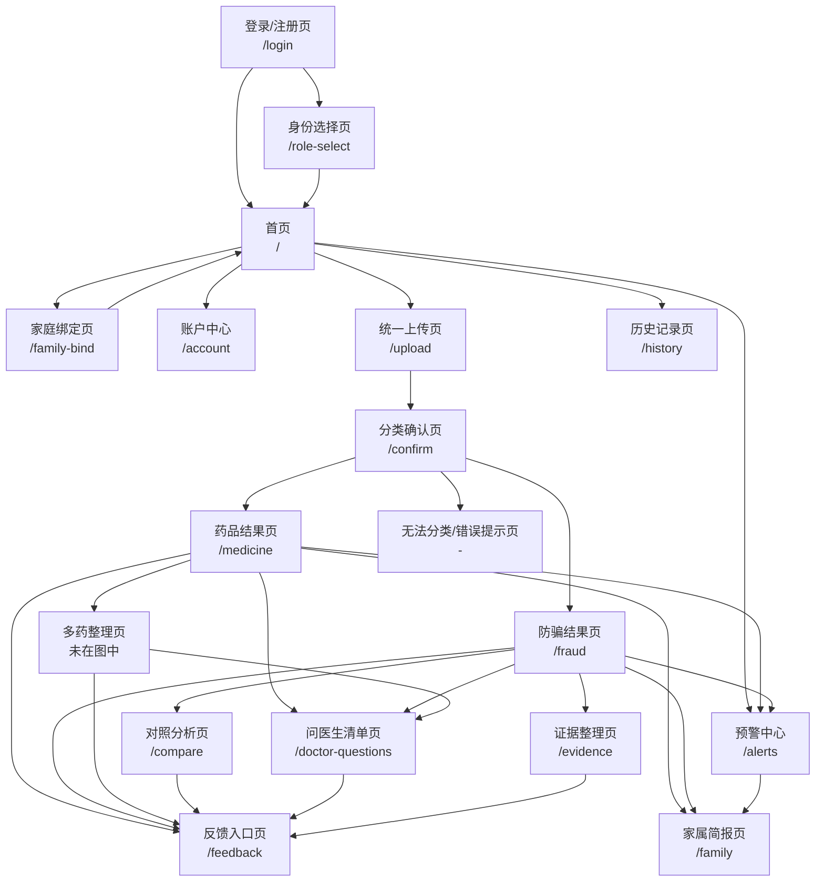

# 用户任务与需求 & 信息架构与页面流程

> 本文件以《用户任务与需求&信息架构与页面流程3.0》为底稿。除账户登录、老人/家属身份选择、家庭绑定、用户信息对象、风险预警与家属通知所涉及的内容外，其余部分保持原文结构和表述。
>
> 系统在线身份仅包括：**老人本人**、**家属/照护者**。医生/药师只作为线下沟通对象，不设置系统身份和账户入口。


## 一、用户任务与需求

### 1.1 目标用户画像

| 用户角色 | 核心特征 | 使用场景 | 核心痛点 |
|---|---|---|---|
| **老年人（主用户）** | 60岁以上，视力退化，对智能设备操作不熟练，健康焦虑高 | 独自在家收到药品/保健品，需要看懂说明；接到推销电话或收到宣传单 | 说明书字太小、术语看不懂；分不清药品和保健品；容易被"特效""治愈"话术诱导 |
| **子女/家庭照护者** | 30-50岁，工作繁忙，与老人分居或同城不同住 | 老人转发推销信息让其判断；定期查看老人用药情况 | 不知道老人接触了什么产品；老人说不清对方要求；担心老人已经付款或泄露信息 |
| **医生/药师（沟通场景）** | 社区医院或药房专业人员 | 老人带着系统生成的材料来咨询 | 老人描述不清用药史；缺乏结构化的问题清单和证据材料 |

> 身份说明：系统注册、登录与身份选择仅面向“老人本人”和“家属/照护者”。医生/药师不注册、不登录，老人或家属通过展示、导出或打印药品清单和问医生清单与其线下沟通。

---

### 1.2 用户任务清单

#### 角色一：老年人

| 任务编号 | 用户任务 | 任务描述 | 对应功能 | 中期优先级 |
|---|---|---|---|---|
| U-ELD-01 | 上传药品材料 | 拍摄药盒、说明书、处方单，上传至系统 | 功能一：统一上传与分类 | **√** |
| U-ELD-02 | 确认材料分类 | 查看系统对上传材料的分类结果，确认或修正 | 功能一：统一上传与分类 | **√** |
| U-ELD-03 | 查看大字版药品说明 | 查看系统生成的通俗版用药卡，包含用法、用量、注意事项 | 功能二：大字版药品说明 | **√** |
| U-ELD-04 | 查看风险等级与警告 | 查看系统对材料的风险判定（绿/黄/红），阅读关键警告 | 功能八：三级风险机制 | **√** |
| U-ELD-05 | 上传保健品/宣传材料 | 拍摄保健品广告、宣传单、微信截图等并上传 | 功能一：统一上传与分类 | **√** |
| U-ELD-06 | 查看防骗分析结果 | 了解为什么这个材料有风险，现在应该停止什么操作 | 功能四：健康消费防骗分析 | **√** |
| U-ELD-07 | 听取语音播报 | 让系统朗读药品说明或风险警告（视技术实现） | 功能十：适老化与无障碍 |   |
| U-ELD-08 | 删除已上传记录 | 主动删除历史分析记录，保护隐私 | 功能十一：历史记录与隐私控制 |   |
| U-ELD-09 | 修改错误分类 | 当系统分类错误时，手动更正材料类型 | 功能一：统一上传与分类 | **√** |
| U-ELD-10 | 核验药品批准文号 | 查看系统对药品批准文号的核验结果，判断药品身份是否可信 | 功能二：大字版药品说明 + 功能四：健康消费防骗分析 | **√** |
| U-ELD-11 | 注册或登录账户 | 使用手机号验证码或中期测试账户进入系统，以便保存记录和使用家庭协同功能 | 功能十三：账户与家庭协同系统 | **√** |
| U-ELD-12 | 选择老人身份 | 首次登录时选择“我是老人本人”，建立老人用户信息对象并进入适老首页 | 功能十三：账户与家庭协同系统 | **√** |
| U-ELD-13 | 邀请家属绑定 | 生成短时有效的家庭绑定码，交给可信家属完成绑定 | 功能十三：账户与家庭协同系统 | **√** |
| U-ELD-14 | 确认家属绑定与授权 | 确认家属身份，并决定其是否可接收红色预警、查看简报和代为上传 | 功能十三：账户与家庭协同系统 | **○** |
| U-ELD-15 | 查看预警处理状态 | 查看红色风险是否已通知家属、家属是否已查看以及当前建议行动 | 功能十四：风险预警与家属通知系统 | **○** |

#### 角色二：子女/家庭照护者

| 任务编号 | 用户任务 | 任务描述 | 对应功能 | 中期优先级 |
|---|---|---|---|---|
| U-FAM-01 | 代老人上传材料 | 帮老人上传药品或推销材料，查看分析结果 | 功能一：统一上传与分类 | **√** |
| U-FAM-02 | 上传聊天/付款记录 | 上传微信聊天截图、转账记录、订单凭证 | 功能一：统一上传与分类 | **√** |
| U-FAM-03 | 生成并查看家属简报 | 查看系统生成的结构化简报，了解老人接触了什么、是否付款、风险等级 | 功能七：家属简报 | **○** |
| U-FAM-04 | 转发家属简报 | 将简报通过微信等方式转发给其他家庭成员 | 功能七：家属简报 | **○** |
| U-FAM-05 | 查看证据整理 | 查看系统整理的事件时间线、销售主体、付款金额、对方承诺 | 功能九：订单与证据整理 |   |
| U-FAM-06 | 查看历史记录 | 查看老人过往上传的材料和分析结果 | 功能十一：历史记录与隐私控制 |   |
| U-FAM-07 | 注册或登录账户 | 使用手机号验证码或中期测试账户进入系统 | 功能十三：账户与家庭协同系统 | **√** |
| U-FAM-08 | 选择家属身份 | 首次登录时选择“我是家属/照护者”，进入家庭绑定引导 | 功能十三：账户与家庭协同系统 | **√** |
| U-FAM-09 | 绑定老人账户 | 输入老人提供的绑定码，选择与老人的关系并提交绑定 | 功能十三：账户与家庭协同系统 | **√** |
| U-FAM-10 | 代老人使用系统 | 在授权范围内代老人上传材料，并将记录归属到对应老人 | 功能十三：账户与家庭协同系统 | **○** |
| U-FAM-11 | 接收红色风险预警 | 在老人授权后接收站内红色预警，查看风险摘要和建议行动 | 功能十四：风险预警与家属通知系统 | **○** |
| U-FAM-12 | 确认已查看预警 | 对预警点击“我已查看”，让老人端看到家属已知晓 | 功能十四：风险预警与家属通知系统 | **○** |

#### 角色三：医生/药师（沟通场景）

| 任务编号 | 用户任务 | 任务描述 | 对应功能 | 中期优先级 |
|---|---|---|---|---|
| U-DOC-01 | 查看药品清单 | 查看老人当前服用药品的结构化列表 | 功能二：大字版药品说明 | **√** |
| U-DOC-02 | 查看处方与说明书差异 | 查看系统标记的处方与说明书不一致之处 | 功能二：大字版药品说明 | **√** |
| U-DOC-03 | 查看问医生清单 | 查看系统生成的需要专业人员回答的问题列表 | 功能六：一键生成问医生清单 |   |
| U-DOC-04 | 查看推销产品材料 | 查看老人上传的保健品宣传材料及风险分析 | 功能四：健康消费防骗分析 | **√** |
| U-DOC-05 | 查看药品真实性核验结果 | 查看药品批准文号、生产企业、规格剂型与官方备案是否一致 | 功能二：大字版药品说明 | **√** |

> 医生/药师相关任务均通过老人或家属展示系统结果完成，不新增医生登录、医生身份选择、医生个人信息对象或医生端页面。

---

### 1.3 功能需求优先级

根据项目统筹规划，中期检查前功能优先级如下：

| 优先级 | 功能模块 | 需求说明 | 验收标准 |
|---|---|---|---|
| **P0-必须做** | 功能一：统一上传与分类 | 支持图片上传、OCR识别、材料自动分类、用户确认分类 | 上传成功、分类正确、可手动修正 |
| **P0-必须做** | 功能二：大字版药品说明 | 提取药品名称、用法、用量、注意事项，生成老人友好的大字版用药卡 | 信息准确、不臆测剂量、区分材料原文与知识库补充 |
| **P0-必须做** | 功能四：健康消费防骗分析 | 识别身份风险、宣传风险、交易风险、情绪操控风险，输出风险等级和证据 | 每条风险有原文证据、有行动建议 |
| **P0-必须做** | 功能八：三级风险机制 | 绿色（信息解释）、黄色（需要核验）、红色（立即停止）贯穿所有输出 | 风险等级判定准确、红色风险优先展示行动提示 |
| **P1-尽量做** | 功能七：家属简报 | 整合药品结果、风险结果、付款信息，生成结构化家属版摘要；红色风险时自动推送，绿/黄时由用户选择 | 简报内容完整、自动推送需授权联系方式 |
| **P1-尽量做** | 功能十一：历史记录与隐私控制 | 在首页提供独立历史记录入口，支持查看、筛选、导出和删除已保存记录 | 入口独立、删除可撤销、隐私最小化 |
| **P0-必须做** | 功能十三：账户与家庭协同系统（基础版） | 支持登录/注册、首次身份选择、老人和家属用户对象、家庭绑定码、最小权限授权和登录态保持 | 老人、家属测试账户均可登录；身份只能二选一；可完成一次老人—家属绑定；刷新后登录态和绑定关系不丢失 |
| **P1-尽量做** | 功能十四：风险预警与家属通知系统（站内版） | 红色风险创建预警事件并生成家属简报；仅向已绑定且已授权家属发送站内提醒 | 红色结果能生成预警；未绑定或未授权不发送；家属可查看并确认已读 |
| **P2-暂不做** | 功能三、五、六、九、十、十二及高级账户通知能力 | 多药整理、药品与保健品对照、问医生清单、证据整理、适老化语音、反馈入口；微信登录、密码找回、真实短信/邮件/公众号推送、多家庭复杂管理 | 中期后迭代 |

---

### 1.4 非功能需求

| 需求项 | 描述 | 影响范围 |
|---|---|---|
| 适老化设计 | 正文字号不小于18px，主按钮高度不小于56px，点击区域充足，高对比度配色 | 所有页面 |
| 响应式布局 | 支持手机（主）、平板、电脑访问，手机端单栏布局，电脑端双栏 | 所有页面 |
| 一屏一任务 | 每个页面只呈现一个核心任务，避免信息过载 | 所有页面 |
| 风险置顶 | 红色/黄色风险警告必须置于页面顶部，不可折叠 | 结果页 |
| 多模态表达 | 风险不能仅通过颜色表达，必须配合图标+文字 | 所有页面 |
| 横向滚动禁止 | 手机端不允许出现横向滚动条 | 所有页面 |
| 错误可撤销 | 关键操作（如删除）需二次确认，支持返回上一步 | 上传流程、历史记录 |
| 隐私最小化 | 登录用户在授权后保存上传材料；敏感信息需单独授权展示；红色风险仅向已绑定且已授权的家属创建预警和简报 | 上传页、结果页、家庭绑定页 |
| 账户安全 | 登录凭证、验证码和会话令牌不得明文写入日志；公开部署前必须关闭固定测试验证码和演示后门 | 登录页、接口、日志 |
| 身份唯一性 | 每个账户首次登录只能选择“老人本人”或“家属/照护者”；中期不支持同一账户同时拥有两种身份 | 身份选择页、路由、数据库 |
| 权限最小化 | 家属只可访问已绑定老人明确授权的数据；原图、付款金额、账户信息和历史记录分别授权 | 家庭绑定页、家属简报、历史记录 |
| 预警可靠性 | 红色风险必须先写入预警记录，再尝试通知；通知失败不影响老人端展示，并允许重试 | 风险结果页、预警中心、通知接口 |
| 预警可追踪 | 记录预警创建时间、接收家属、发送状态、查看状态和确认时间，不允许只显示“已发送”而无记录 | 预警中心、数据库 |
| 会话与退出 | 支持安全退出；登录失效时跳转登录页，并提示当前操作是否可以恢复 | 所有需登录页面 |

---

## 二、信息架构


### 2.1 站点地图

```
银龄安心网页应用
│
├── 登录/注册 (/login) 【中期必须做】
│   ├── 手机号输入
│   ├── 验证码登录（正式方案）/测试账户登录（中期方案）
│   ├── 用户协议与隐私说明勾选
│   └── 登录成功后的路由判断
│       ├── 未选择身份 → /role-select
│       └── 已选择身份 → /
│
├── 身份选择 (/role-select) 【中期必须做】
│   ├── 我是老人本人
│   ├── 我是家属/照护者
│   ├── 两种身份差异说明
│   └── 保存身份后进入对应首页
│
├── 家庭绑定 (/family-bind) 【中期必须做基础版】
│   ├── 老人端：生成6位绑定码
│   ├── 家属端：输入绑定码
│   ├── 选择关系（子女/配偶/亲属/照护者/其他）
│   ├── 老人确认绑定
│   ├── 授权红色预警、家属简报、代上传和历史摘要
│   ├── 已绑定成员列表
│   └── 解除绑定（二次确认）
│
├── 账户中心 (/account) 【中期尽量做】
│   ├── 基本资料
│   ├── 当前身份
│   ├── 家庭成员与权限
│   ├── 预警通知设置
│   ├── 数据保存期限
│   └── 退出登录
│
├── 预警中心 (/alerts) 【中期尽量做基础版】
│   ├── 老人端：查看预警是否已通知家属
│   ├── 家属端：查看已绑定老人的红色预警
│   ├── 预警摘要与关键证据
│   ├── 家属“我已查看”确认
│   └── 通知失败与重试状态
│
├── 首页 (/)
│   ├── 老人首页
│   │   ├── 主入口：拍照/上传材料
│   │   ├── 次入口：查看历史记录 → 跳转 /history
│   │   ├── 次入口：邀请家人绑定 → 跳转 /family-bind
│   │   └── 次入口：查看预警状态 → 跳转 /alerts
│   ├── 家属首页
│   │   ├── 主入口：代老人上传材料
│   │   ├── 次入口：查看已绑定老人
│   │   ├── 次入口：查看红色预警 → 跳转 /alerts
│   │   └── 次入口：家庭绑定 → 跳转 /family-bind
│   ├── 功能简介（3句话）
│   └── 隐私提醒
│
├── 统一上传 (/upload) 【中期必须做】
│   ├── 选择材料所属老人（家属代上传时）
│   ├── 选择文件（拍照/相册/文件）
│   ├── 图片预览与裁剪
│   ├── 隐私遮挡提示（如检测到敏感信息）
│   ├── 上传中状态
│   ├── OCR识别中状态
│   └── 分析中状态
│
├── 分类确认 (/confirm) 【中期必须做】
│   ├── 系统分类结果展示
│   ├── 置信度提示（高/中/低）
│   ├── 用户确认按钮
│   ├── 分类修正选项（正规药品/保健品/宣传材料/聊天截图/订单凭证/无法判断）
│   └── 重新上传入口
│
├── 药品结果 (/medicine) 【中期必须做】
│   ├── 风险等级标识（绿/黄/红）
│   ├── 大字版用药卡
│   │   ├── 药名与规格
│   │   ├── 主要用途
│   │   ├── 每次用量（材料原文）
│   │   ├── 每日次数（材料原文）
│   │   ├── 服用时间（饭前/饭后/睡前……）
│   │   ├── 重要注意事项
│   │   ├── 禁忌
│   │   └── 储存要求
│   ├── 药品真实性核验
│   │   ├── 批准文号识别（国药准字 H/Z/SXXXXXXXX）
│   │   ├── 批准文号是否存在
│   │   ├── 药品名称是否匹配
│   │   ├── 生产企业是否匹配
│   │   └── 规格/剂型是否匹配
│   ├── 信息来源标注（材料原文 vs 知识库）
│   ├── 需要确认的问题（如药名模糊）
│   └── 家庭协同
│       ├── 绿/黄：用户主动生成家属简报
│       ├── 红色：进入预警判断
│       └── 未绑定/未授权：提示前往家庭绑定，不自动发送
│
├── 防骗结果 (/fraud) 【中期必须做】
│   ├── 风险等级标识（绿/黄/红）
│   ├── 立即操作提示（红色时置顶）
│   ├── 关键风险证据（最多3条）
│   ├── 详细风险分析
│   │   ├── 身份风险
│   │   ├── 宣传风险
│   │   ├── 交易风险
│   │   ├── 情绪操控风险
│   │   └── 产品真实性风险（假药/假冒产品/非法药品）
│   ├── 核验方式建议
│   ├── 证据保存提醒
│   └── 家庭协同
│       ├── 红色：创建预警事件并生成家属简报
│       ├── 已绑定且已授权：向家属创建站内提醒
│       └── 未绑定或未授权：只在老人端提示，不对外发送
│
├── 家属简报 (/family) 【中期尽量做】
│   ├── 老人上传材料摘要
│   ├── 涉及产品/销售人员
│   ├── 付款状态与金额
│   ├── 是否被要求停药
│   ├── 是否泄露个人信息
│   ├── 最高风险等级
│   ├── 风险原文证据
│   ├── 建议家属行动
│   ├── 导出/转发按钮
│   └── 打印优化样式
│
├── 对照分析 (/compare) 【暂不做】
│   ├── 正规药品信息
│   ├── 推销产品信息
│   ├── 对比表格
│   └── 替代治疗风险提示
│
├── 问医生清单 (/doctor-questions) 【暂不做】
│   ├── 自动生成问题列表
│   ├── 按优先级排序
│   └── 打印/导出功能
│
├── 证据整理 (/evidence) 【暂不做】
│   ├── 事件时间线
│   ├── 销售主体信息
│   ├── 付款记录汇总
│   ├── 对方承诺记录
│   └── 缺失证据提示
│
├── 历史记录 (/history) 【暂不做】
│   ├── 本人记录列表（老人）
│   ├── 已授权老人记录摘要（家属）
│   ├── 筛选功能（按材料类型/风险等级）
│   ├── 查看详情
│   ├── 导出功能
│   └── 删除功能
│
├── 反馈与复核 (/feedback) 【暂不做】
│   ├── 反馈类型选择
│   ├── 关联记录选择
│   ├── 问题描述输入
│   ├── 补充图片上传（可选）
│   ├── 提交确认
│   └── 提交成功提示
│
├── 隐私说明 (/privacy)
│   ├── 账户与身份数据说明
│   ├── 家庭绑定和权限说明
│   ├── 预警通知与敏感信息说明
│   ├── 保存与删除政策
│   └── 联系方式
│
└── 错误页与状态页
    ├── 登录失败/登录失效
    ├── 身份未选择
    ├── 绑定码错误/过期/重复绑定
    ├── 无权限访问
    ├── 预警创建失败/通知失败
    ├── 模糊图片提示
    ├── OCR失败提示
    ├── 无法分类提示
    ├── 工作流超时提示
    ├── 空状态（无历史记录/无预警）
    └── 404/网络错误
```


### 2.2 页面清单与中期交付范围

| 页面 | 路由 | 中期状态 | 说明 |
|---|---|---|---|
| 登录/注册页 | /login | **√** | 账户入口；中期可使用预置测试账户或测试验证码，公开部署前必须关闭测试方式 |
| 身份选择页 | /role-select | **√** | 首次登录必经；只允许选择“老人本人”或“家属/照护者” |
| 家庭绑定页 | /family-bind | **√（基础版）** | 完成绑定码生成、输入、老人确认和最小权限授权 |
| 账户中心 | /account | **○** | 展示基本资料、当前身份、家庭成员、权限和退出登录；中期可先做简化版 |
| 预警中心 | /alerts | **○** | 中期至少完成红色预警列表、详情和“我已查看”状态 |
| 首页 | / | **√** | 根据老人/家属身份展示不同入口，包含上传、家庭绑定和预警入口 |
| 统一上传页 | /upload | **√** | 核心流程起点；家属代上传时需记录材料所属老人 |
| 分类确认页 | /confirm | **√** | 人机协同确认，降低误分类风险 |
| 药品结果页 | /medicine | **√** | 核心演示场景之一，支持药品批准文号真实性核验 |
| 防骗结果页 | /fraud | **√** | 核心演示场景之一；红色结果进入预警判断 |
| 家属简报页 | /family | **○** | 亮点功能，体现"全家照护"；红色预警可关联简报 |
| 对照页 | /compare |   | 功能五，中期后迭代 |
| 问医生清单 | /doctor-questions |   | 功能六，中期后迭代；仅供老人/家属导出后线下沟通 |
| 证据整理页 | /evidence |   | 功能九，中期后迭代 |
| 历史记录页 | /history | **○** | 功能十一，在首页设有独立入口；家属访问需老人授权 |
| 反馈页 | /feedback |   | 功能十二，中期后迭代 |
| 隐私说明页 | /privacy | **√** | 合规与信任基础，补充账户、家庭绑定、权限和预警通知说明 |
| 错误页/状态页 | - | **√** | 覆盖登录、绑定、无权限、预警通知和核心分析异常 |

---

## 三、页面流程


### 核心流程总览



流程关系说明：

- 用户首次进入系统时先完成**登录/注册**；尚未选择身份的账户进入**身份选择页**，且只能选择“老人本人”或“家属/照护者”；
- **医生/药师不设置系统身份**，问医生清单由老人或家属导出、打印或现场展示；
- 登录后进入与身份对应的首页；老人可上传本人材料、邀请家属和查看预警状态，家属可在绑定后代老人上传并查看获授权的预警；
- **家庭绑定页**负责建立老人—家属关系和授权范围，未绑定或未授权时，系统不得向家属展示老人数据；
- **统一上传页 → 分类确认页 → 药品结果页/防骗结果页**构成核心分析流程；
- 红色风险结果先创建**预警事件**，再根据绑定与授权情况生成家属简报和站内提醒；绿色、黄色结果仍由用户主动生成简报；
- **历史记录页**和**家属简报页**与主分析流程平行，家属访问时必须通过家庭关系和权限校验；
- **多药整理页、问医生清单页**是药品结果页的延伸功能；**对照分析页、证据整理页**是防骗结果页的延伸功能；
- 四条延伸功能路径最终均汇入**反馈入口页**，作为全局反馈出口。

---

### 3.1 流程1：统一上传与分类（√）

**用户目标**：将手中的材料拍照上传，让系统知道这是什么。

**流程步骤**：

```
步骤1：首页
├── 进入首页前检查登录状态和身份
│   ├── 未登录：跳转登录页 (/login)
│   ├── 已登录但未选择身份：跳转身份选择页 (/role-select)
│   └── 已登录且已选择身份：进入对应首页
├── 老人看到主按钮"拍照或上传材料"
├── 家属看到主按钮"代老人上传材料"
│   ├── 已绑定老人：先选择本次材料所属老人
│   └── 未绑定老人：提示先进入家庭绑定页 (/family-bind)
├── 可选次按钮"查看历史记录"（跳转历史记录页）
├── 可选次按钮"邀请/绑定家人"（跳转家庭绑定页）
└── 点击主按钮 → 进入上传页

步骤2：上传页 (/upload)
├── 系统记录本次操作人 operator_user_id
├── 系统记录材料所属老人 subject_user_id
│   ├── 老人本人上传：operator_user_id = subject_user_id
│   └── 家属代上传：subject_user_id 必须来自已绑定且允许代上传的老人
├── 用户选择输入方式：拍照 / 相册选择 / 文件上传
├── 系统限制：仅接受图片格式（jpg/png），单张不超过10MB
├── 图片预览：显示裁剪框，建议用户对准文字区域
├── 隐私提示："上传的材料将默认保存，便于后续查看和家属协同"
├── 隐私信息检测（上传后自动识别身份证、银行卡、验证码、地址、电话等敏感信息）
│   ├── 未检测到敏感信息：进入步骤3
│   └── 检测到敏感信息：
│       ├── 高亮标记敏感区域
│       ├── 提示文案："检测到图片中可能包含身份证/银行卡/验证码等敏感信息，建议遮挡后重新拍摄"
│       ├── 按钮A："重新上传" → 返回步骤2重新选择图片
│       ├── 按钮B："我已确认，继续识别" → 进入步骤3（需用户明确授权）
│       └── 按钮C："取消上传" → 返回首页
└── 用户点击"开始识别" → 进入步骤3

步骤3：预处理状态（页面内转圈，不跳转）
├── 状态1：上传中...（进度条）
├── 状态2：检查清晰度...（如模糊提示重新拍摄）
├── 状态3：隐私信息复核...（再次确认是否包含身份证号、银行卡号、验证码、地址、电话等）
│   └── 若复核发现敏感信息且用户未授权，暂停并提示重新上传
├── 状态4：OCR识别中...（提取文字）
├── 状态5：图片理解中...（识别包装特征）
└── 完成后自动跳转步骤4

步骤4：分类确认页 (/confirm)
├── 展示系统分类结果："系统判断这是：[正规药品]"
├── 展示置信度：高/中/低
├── 分支A：用户点击"确认正确" → 进入对应结果页
├── 分支B：用户选择"这不是药品，这是..." → 修正分类
│   └── 选项：保健食品/健康宣传/推销聊天/订单凭证/医疗器械/无法判断
├── 分支C：用户点击"重新上传" → 返回步骤2
└── 低置信度时强制要求确认，不可跳过
```

**异常分支**：
- 文件过大 → 提示"图片太大，请压缩后重试"
- 非图片格式 → 提示"请上传照片"
- 图片模糊 → 提示"照片不够清晰，建议对准材料重新拍摄"
- 检测到隐私敏感信息（身份证、银行卡、验证码、地址、电话等） → 提示"检测到敏感信息，建议遮挡后重新拍摄，或确认后继续"
- OCR失败 → 提示"未能识别文字，请尝试调整光线后重拍"

---

### 3.2 流程2：药品解读（√）

**用户目标**：看懂手中的药品应该怎么吃，有什么要注意的。

**前置条件**：用户上传材料并确认分类为"正规药品"或"药品说明书"

**流程步骤**：

```
步骤1：进入药品结果页 (/medicine)
├── 顶部：风险等级标识（绿色=暂未发现明显风险）
├── 第一屏：大字版用药卡（核心信息）
│   ├── 药名：XXX（材料原文）
│   ├── 规格：XXX（材料原文）
│   ├── 用途：XXX（材料原文 + 知识库通俗解释）
│   ├── 每次吃：X片/粒（材料原文，如材料未提及则显示"材料未说明，请查看说明书或询问药师"）
│   ├── 每天吃：X次（材料原文）
│   ├── 什么时候吃：饭前/饭后/睡前（材料原文）
│   └── 重要提醒：XXX（如"服药期间避免饮酒"）
├── 第二屏：详细信息（点击展开）
│   ├── 禁忌：XXX
│   ├── 常见不良反应：XXX
│   ├── 储存要求：XXX
│   └── 信息来源标注："以上用量来自您上传的处方" / "以上说明来自药品知识库"
├── 第三屏：药品真实性核验
│   ├── 批准文号：XXX（OCR识别，如"国药准字H12345678"）
│   ├── 核验状态：
│   │   ├── 绿色：批准文号存在，且名称、生产企业、规格/剂型均匹配
│   │   ├── 黄色：批准文号暂未核验成功，或部分字段无法确认
│   │   └── 红色：批准文号对应其他药品，或名称/厂家/规格不一致
│   ├── 核验结果展示：
│   │   ├── 包装显示：某某降压神药 / 国药准字H12345678 / XX制药厂 / 10mg×30片
│   │   └── 官方备案：某普通感冒药 / 国药准字H12345678 / YY药业 / 5mg×20片
│   ├── 风险提示（黄色）："该药品批准文号暂未核验成功，建议通过正规渠道查询"
│   ├── 风险提示（红色）："包装显示的批准文号对应其他药品，产品信息存在不一致风险"
│   └── 建议行动：暂停使用、保留包装、咨询正规医院或药师
├── 第四屏：需要确认的问题（如存在）
│   ├── "药名识别模糊，请确认是否为'XXX'？"
│   └── "处方与说明书服用时间不一致，请以医生处方为准"
├── 第五屏：医生补充说明
│   ├── 输入框标题："医生有没有额外嘱咐？"
│   ├── 输入框提示："如医生说的吃法、用量和说明书不一样，请在这里补充"
│   ├── 用户可输入文字（如"医生让早晚各1片，但说明书写的每日1片"）
│   ├── 系统对比输入内容与说明书/处方后给出提示：
│   │   └── "您输入的医生说明与现有材料不一致，请以医生当面嘱咐为准，必要时可咨询药师"
│   └── 该补充说明可同步到家属简报和问医生清单
└── 底部按钮：
    ├── 绿色/黄色："生成家属简报" → 跳转 /family
    ├── 红色：先创建预警事件，再判断是否存在已绑定且已授权家属
    │   ├── 有授权家属：生成家属简报并创建站内提醒，可跳转 /alerts
    │   └── 无授权家属：只在老人端显示红色警告，并提示前往 /family-bind
    ├── "重新上传" → 返回 /upload
    └── "返回首页" → 返回 /

约束：
- 若材料中未提及剂量，绝不根据常识补全
- 若药名或规格不清楚，提示"请重新拍摄或手动输入"，不继续推断
- 不出现"建议停药/换药/改量"等医疗建议
- 处方与说明书不一致时，明确提示"以医生处方为准"
- 药品真实性核验仅作为辅助参考，系统不直接判定"这是假药"，只提示"发现信息不一致，建议通过官方渠道进一步核验"
```

---

### 3.3 流程3：多药整理

**用户目标**：同时管理多种药品，避免吃错、重复或时间冲突。

**前置条件**：用户已上传两种及以上药品材料，或从药品结果页点击"我还有其他药品"

**流程步骤**：

```
步骤1：进入多药整理页 (/multi-medicine)
├── 顶部：已整理药品数量（"已整理3种药品"）
├── 第一屏：服用时间线表格（手机端转为卡片）
│   ├── 时间轴：早餐后 / 午餐前 / 晚餐后 / 睡前
│   ├── 每个时间点卡片：
│   │   ├── 药品名称
│   │   ├── 材料中记录的用量
│   │   ├── 来源（医院处方/药品说明书/药盒）
│   │   └── 提醒标签（按处方使用/询问药师/注意头晕）
│   └── 电脑端展示为表格，手机端展示为垂直时间轴卡片
├── 第二屏：系统提醒（黄色/红色警告）
│   ├── "药品A与药品B成分疑似相同，注意重复"
│   ├── "药品C与药品D名称相似，注意拿错"
│   ├── "药品E处方写每日2次，说明书写每日3次，请以处方为准"
│   └── "药品F材料缺少服用时间，请补充确认"
├── 第三屏：问药师清单预览
│   ├── "我现在服用的药是否存在疑似重复成分？"
│   ├── "处方和说明书的服用时间不同，应以哪个为准？"
│   └── "这款保健品能否与现有药品一起使用？"
├── 第四屏：操作入口
│   ├── "生成完整问医生清单" → 跳转 /doctor-questions
│   ├── "生成家属简报"（绿/黄时显示）→ 跳转 /family
│   ├── 红色风险时创建预警事件；仅向已绑定且已授权家属创建站内提醒
│   ├── "继续上传药品" → 返回 /upload
│   └── "导出用药时间表" → 生成图片/PDF
└── 底部按钮：返回首页 / 重新上传

约束：
- 系统只提示疑似问题，不直接要求删除某种药或更改剂量
- 所有提醒必须标注信息来源（哪张材料触发的提醒）
- 时间线必须基于用户材料原文，不臆测服用时间
```

---

### 3.4 流程4：健康消费防骗分析（√）

**用户目标**：判断收到的保健品宣传是否可信，现在应该停止什么操作。

**前置条件**：用户上传材料并确认分类为"健康宣传/推销聊天/订单凭证/保健食品/医疗器械"

**流程步骤**：

```
步骤1：进入防骗结果页 (/fraud)
├── 顶部：风险等级标识（红/黄/绿）
│   └── 若为红色，置顶显示立即行动（大字+图标，不可折叠）：
│       "先别付款" / "不要提供验证码" / "不要停掉现在吃的药" / "请让家里人一起看"
├── 第一屏：关键风险证据（最多3条，大字展示，每条包含）
│   ├── 证据原文引用："对方说'可以替代降压药'"
│   ├── 风险类别标签：诱导替代治疗
│   └── 为什么需要警惕："正规药品不可替代，停药可能导致病情恶化"
├── 第二屏：详细风险分析（分类展开）
│   ├── 身份风险
│   │   ├── 是否冒充医生/专家/医保人员/官方人员？
│   │   ├── 机构信息是否清晰？
│   │   ├── 是否只提供私人微信？
│   │   └── 是否要求离开正规平台沟通？
│   ├── 宣传风险
│   │   ├── 是否声称"包治百病"？
│   │   ├── 是否声称"彻底治愈慢性病"？
│   │   ├── 是否声称"可以替代处方药"？
│   │   ├── 是否声称"绝对没有副作用"？
│   │   ├── 是否使用患者故事代替科学证据？
│   │   └── 是否提及"内部渠道""特供""进口神药"？
│   ├── 交易风险
│   │   ├── 是否要求立即付款？
│   │   ├── 是否只接受私人转账？
│   │   ├── 是否限时/限量？
│   │   ├── 是否先赠送后高价销售？
│   │   ├── 是否收取会员费/保证金？
│   │   ├── 是否不提供订单和退款规则？
│   │   └── 是否索要银行卡/身份证/验证码？
│   ├── 情绪操控风险
│   │   ├── "不买会错过最佳治疗时间"
│   │   ├── "不要告诉子女"
│   │   ├── "你的身体已经非常危险"
│   │   ├── "今天不交钱优惠就没有了"
│   │   └── "内部消息不能外传"
│   └── 产品真实性风险
│       ├── 无批准信息（如缺少国药准字、备案号）
│       ├── 无正规销售渠道（如仅微信私人销售）
│       ├── 冒充医院内部药/专家特供药
│       ├── 冒充进口特效药
│       ├── 包装信息异常（如批号模糊、日期修改痕迹）
│       ├── 药品名称无法查询或过度夸张（如"神效降糖丸"）
│       ├── 过期药重新包装
│       └── 保健品/普通食品冒充药品
├── 第三屏：行动建议
│   ├── 现在应立即停止的操作：XXX
│   ├── 下一步核验方式：XXX（如"拨打医院官方电话核实"）
│   └── 需要保存的证据：XXX（如"保存聊天记录和转账截图"）
├── 第四屏：关联功能入口
│   ├── "整理证据材料" → 跳转证据整理页 (/evidence)
│   ├── "与我的药品对照" → 跳转对照分析页 (/compare)
│   ├── "生成家属简报"（绿/黄时显示）→ 跳转家属简报页 (/family)
│   ├── 红色风险：创建预警事件并生成家属简报
│   │   ├── 已绑定且授权：向家属创建站内提醒 → /alerts
│   │   └── 未绑定或未授权：只提示老人绑定家属，不对外发送
│   └── "生成问医生清单" → 跳转问医生清单页 (/doctor-questions)
└── 底部按钮：重新上传 / 返回首页

风险等级判定逻辑：
- 绿色：正规药品/普通健康资讯，暂未发现明显风险，提供通俗解释
- 黄色：产品身份不清、宣传模糊、存在夸大倾向、批准文号暂未核验成功，建议先询问家属/医生
- 红色：出现索要验证码、私人转账、诱导停药、冒充官方、威胁恐吓、不让告诉子女，或批准文号对应其他药品/产品信息严重不一致 → 立即停止操作

输出格式约束：
- 每条风险必须提供原文证据
- 不得只根据单个关键词判断
- 不无证据判定诈骗
- 不直接认定违法
- 不使用恐吓语言
```

---

### 3.5 流程5：药品与保健品交叉对照

**用户目标**：同时看医院开的药和推销的产品，直观对比差异。

**前置条件**：用户已上传正规药品材料，且同时上传了保健品/推销产品材料

**流程步骤**：

```
步骤1：进入对照分析页 (/compare)
├── 顶部：对照标题"药品与推销产品对比"
├── 第一屏：并排对照卡片（手机端上下排列，电脑端左右排列）
│   ├── 左侧：正规药品或处方
│   │   ├── 产品类别：根据材料识别
│   │   ├── 信息来源：处方/说明书
│   │   ├── 批准文号：XXX（如"国药准字H12345678"）
│   │   ├── 批准文号核验状态：一致/不一致/未识别
│   │   ├── 生产企业：XXX
│   │   ├── 规格/剂型：XXX
│   │   ├── 是否诱导替代治疗：未发现/待确认
│   │   ├── 购买渠道：医院或正规药房
│   │   └── 付款方式：正规订单
│   └── 右侧：推销产品
│       ├── 产品类别：根据包装识别
│       ├── 信息来源：宣传材料
│       ├── 批准文号：XXX（如"国药准字H12345678"或无）
│       ├── 批准文号核验状态：一致/不一致/未识别/无批准文号
│       ├── 生产企业：XXX
│       ├── 规格/剂型：XXX
│       ├── 是否诱导替代治疗：发现/未发现
│       ├── 购买渠道：私人微信/讲座/直播
│       └── 付款方式：私人账户/二维码
├── 第二屏：关键差异高亮
│   ├── 红色高亮："推销产品声称可替代处方药"
│   ├── 红色高亮："推销产品批准文号缺失或与官方备案不一致"
│   ├── 黄色高亮："推销产品渠道非正规"
│   └── 绿色提示："请继续按处方服用医院药品"
├── 第三屏：当前建议
│   ├── 正规药品：按处方使用
│   └── 推销产品：暂停购买并核验
└── 底部按钮：返回药品结果 / 返回防骗结果 / 生成家属简报（绿/黄时显示；红色时进入预警授权判断）

约束：
- 只比较产品身份、宣传范围、替代治疗风险和交易渠道
- 不比较"哪一种疗效更好"
- 所有对比项必须标注信息来源
```

---

### 3.6 流程6：一键生成问医生清单

**用户目标**：把说不清楚的问题整理成清单，方便问医生或药师。

**前置条件**：用户已完成药品解读、多药整理或防骗分析，点击"生成问医生清单"

**流程步骤**：

```
步骤1：进入问医生清单页 (/doctor-questions)
├── 顶部：说明"以下问题由系统根据您上传的材料整理，请携带材料原件就诊"
├── 第一屏：问题列表（按优先级排序）
│   ├── 高优先级（红色标签）：涉及用药安全
│   │   ├── "对方说可以停掉原来的药，这种说法可信吗？"
│   │   └── "我现在服用的药是否存在疑似重复成分？"
│   ├── 中优先级（黄色标签）：涉及用法用量
│   │   ├── "处方和说明书的服用时间不同，应以哪个为准？"
│   │   └── "这款保健品能否与现有药品一起使用？"
│   └── 低优先级（绿色标签）：一般咨询
│       ├── "最近出现头晕，需要检查还是调整处方？"
│       └── "还需要补充哪些药盒或检查材料？"
├── 第二屏：问题详情（点击展开）
│   ├── 问题背景："该问题来自您上传的处方与说明书差异"
│   ├── 关联材料："材料1：医院处方；材料2：药品说明书"
│   └── 当前无法确认的字段："该药品批号未能识别"
├── 第三屏：操作
│   ├── "打印清单" → 生成A4排版页面
│   ├── "导出图片" → 生成长图便于微信发给医生
│   ├── "添加自定义问题" → 用户手动输入补充问题
│   └── "重新生成" → 基于最新上传材料重新整理
└── 底部按钮：返回首页 / 生成家属简报（绿/黄时显示；红色时进入预警授权判断）

约束：
- 系统只负责整理问题，不代替医生作出判断
- 每个问题必须标注来源（来自哪张材料）
- 不编造问题，只基于材料中的冲突和不确定项生成
```

---

### 3.7 流程7：家属简报生成（○）

**用户目标**：让子女快速了解老人遇到了什么，是否需要干预。

**前置条件**：用户已完成药品解读、防骗分析或多药整理；绿色或黄色风险由用户主动点击"生成家属简报"；红色风险由系统自动生成简报，但只有存在已绑定且已授权家属时才创建家属站内提醒

**流程步骤**：

```
步骤1：进入家属简报页 (/family)
├── 权限校验
│   ├── 老人本人：可查看本人简报
│   ├── 家属：仅可查看已绑定老人且获授权的简报
│   └── 未登录、未绑定或无权限：跳转登录/家庭绑定/无权限提示
├── 简报标题："家人查看简报"
├── 模块1：老人上传了什么
│   ├── 材料类型：药品/保健品广告/聊天记录/订单凭证
│   ├── 涉及产品：XXX
│   ├── 销售人员/机构：XXX（如识别到）
│   ├── 上传时间：XXX
│   └── 上传材料原图/缩略图（保留用户上传的图片，便于家属核对原件）
├── 模块2：财务与信息安全（红色高亮敏感项）
│   ├── 是否已付款：是/否/未知
│   ├── 付款金额：XXX（如识别到）
│   ├── 付款账户：XXX（如识别到）
│   ├── 是否被要求停药：是/否
│   └── 是否泄露身份证/银行卡/验证码：是/否/未知
├── 模块3：风险摘要
│   ├── 最高风险等级：红色/黄色/绿色
│   ├── 风险原文证据：引用原文（最多3条）
│   └── 风险类别：身份/宣传/交易/情绪操控/产品真实性
├── 模块4：建议家属行动
│   ├── 立即行动：XXX（如"与老人确认是否已付款"）
│   ├── 核实步骤：XXX（如"拨打12315咨询"）
│   └── 保留证据：XXX
├── 模块5：问医生清单速览（如已生成）
│   └── 显示高优先级问题数量，可跳转详情
└── 底部按钮：
    ├── "转发给家人"（调用系统分享或复制链接）
    ├── "导出图片"（生成长图便于微信转发）
    ├── "打印"（打印优化样式）
    └── "返回" → 返回上一页

重要约束：
- 红色风险等级时，系统自动生成家属简报和预警事件；绿色或黄色时，由用户主动点击生成并转发
- 只有“已绑定 + 老人已授权接收红色预警”的家属才会收到站内提醒
- 未绑定、绑定待确认、权限已关闭或关系已解除时，不得向家属发送或展示老人数据
- 中期只要求实现站内提醒；短信、邮件、公众号模板消息必须在真实接口接通并获得用户授权后再启用
- 不默认包含敏感信息（如银行卡号），原图、具体金额和账户信息需单独授权展示
- 简报生成后默认保存到对应老人账户，用户可主动删除
- 家属查看简报后可点击“我已查看”，系统记录查看时间并在老人端显示状态
```

---

### 3.8 流程8：证据整理

**用户目标**：把散落的聊天记录、转账记录、订单凭证整理成结构化证据。

**前置条件**：用户上传了聊天截图、订单凭证、转账记录等材料，或从防骗结果页点击"整理证据"

**流程步骤**：

```
步骤1：进入证据整理页 (/evidence)
├── 顶部：事件标题"证据材料整理"
├── 第一屏：事件时间线（垂直时间轴）
│   ├── 日期1：老人收到健康讲座邀请
│   ├── 日期2：参加讲座，领取免费赠品
│   ├── 日期3：对方添加微信，发送产品资料
│   ├── 日期4：老人询问是否可替代降压药
│   ├── 日期5：对方要求微信转账
│   └── 日期6：老人上传材料至本系统
├── 第二屏：信息汇总卡片
│   ├── 销售主体：XXX（姓名/微信/机构，如识别到）
│   ├── 产品名称：XXX
│   ├── 付款金额：XXX
│   ├── 付款账户：XXX
│   ├── 对方承诺：XXX（原文引用）
│   └── 退款约定：XXX（如识别到）
├── 第三屏：已保存证据清单
│   ├── 材料1：微信聊天截图（已上传）
│   ├── 材料2：转账记录（已上传）
│   └── 材料3：产品宣传单（已上传）
├── 第四屏：仍缺少的证据（黄色提示）
│   ├── "缺少对方完整身份信息"
│   ├── "缺少产品完整包装照片"
│   └── "缺少通话录音或文字记录"
├── 第五屏：咨询/投诉/报警材料准备建议
│   ├── 向12315投诉需准备：XXX
│   ├── 向公安机关报案需准备：XXX
│   └── 向消费者协会求助需准备：XXX
└── 底部按钮：导出证据包 / 生成家属简报（绿/黄时显示；红色时进入预警授权判断） / 返回首页

约束：
- 系统不自动报警，只帮助用户整理
- 时间线基于用户上传材料，不臆测未上传的事件
- 所有引用必须标注来源材料
```

---

### 3.9 流程9：历史记录与隐私控制

**用户目标**：查看、管理之前上传和分析过的材料。

**前置条件**：用户已登录并授权保存历史记录；家属查看老人记录时，还必须已完成家庭绑定并获得历史摘要或历史详情权限

**流程步骤**：

```
步骤1：进入历史记录页 (/history)
├── 身份与权限判断
│   ├── 老人：查看本人记录
│   ├── 家属：先选择已绑定老人，只显示获授权范围内的记录
│   └── 无权限：显示无权限提示，不返回任何记录
├── 顶部：记录统计（"共3条记录，1条待确认"）
├── 第一屏：筛选栏
│   ├── 按日期范围筛选
│   ├── 按材料类型筛选（药品/保健品/宣传/聊天/订单）
│   ├── 按风险等级筛选（绿/黄/红）
│   └── 按关键词搜索
├── 第二屏：记录列表（卡片式，每张卡片包含）
│   ├── 缩略图
│   ├── 材料类型标签
│   ├── 风险等级色块
│   ├── 分析日期
│   ├── 简要摘要（"降压药处方 - 绿色"）
│   └── 操作按钮：查看详情 / 导出 / 删除
├── 第三屏：记录详情（点击卡片进入）
│   ├── 原图查看
│   ├── 结构化结果（复用对应结果页布局）
│   └── 关联分析（如该记录参与了多药整理或对照分析）
├── 第四屏：批量操作
│   ├── 批量选择
│   ├── 批量导出（PDF压缩包）
│   └── 批量删除（二次确认）
└── 底部：隐私设置入口
    ├── 自动过期时间设置（7天/30天/90天/永久）
    ├── 一键清除所有记录
    └── 数据使用说明

空状态：
├── 当无记录时显示："暂无记录，上传材料开始分析"
└── 提供快捷入口：跳转上传页

约束：
- 登录用户在授权后保存上传材料；材料必须关联 subject_user_id，避免家属代上传后记录归属错误
- 家属只可访问已绑定老人明确授权的范围，不能通过修改URL或参数越权查看其他老人记录
- 敏感信息需用户单独授权后展示
- 原图与结构化结果分开保存
- 删除后不可恢复，需二次确认；家属是否可删除由老人权限决定
- 自动过期删除前3天提醒用户
```

---

### 3.10 流程10：反馈与人工复核入口

**用户目标**：告诉系统哪里错了，帮助改进。

**前置条件**：用户在任意结果页发现错误

**流程步骤**：

```
步骤1：进入反馈页 (/feedback)
├── 顶部："帮助我们改进"
├── 第一屏：反馈类型选择（单选）
│   ├── "分类错误"（如系统把药品错分为保健品）
│   ├── "药品识别错误"（如药名识别错误）
│   ├── "药品真实性核验错误"（如批准文号识别错误、核验结果与官方备案不符）
│   ├── "风险判断不准确"（如漏判了诱导停药风险）
│   ├── "结果太复杂，看不懂"
│   ├── "已经向医生确认，系统判断有误"
│   ├── "需要家属帮助"
│   └── "其他"
├── 第二屏：问题描述
│   ├── 关联记录选择（从最近分析记录中选择）
│   ├── 文字描述输入框
│   └── 补充图片上传（可选）
├── 第三屏：提交确认
│   ├── 是否允许使用此反馈改进系统（默认勾选）
│   ├── 联系方式（可选，用于回访）
│   └── 提交按钮
└── 提交后："感谢您的反馈，我们将持续改进"

约束：
- 反馈不强制要求用户留下联系方式
- 反馈内容仅用于改进测试集和提示词
- 提交后给予明确确认
```

---

### 3.11 异常流程（√）

| 异常场景 | 触发条件 | 页面表现 | 用户操作 | 跳转目标 |
|---|---|---|---|---|
| 图片模糊 | 清晰度检测得分低于阈值 | 全屏提示页：照片不够清晰，建议重新拍摄 | 重新拍摄或手动输入 | 返回 /upload |
| OCR失败 | 文字提取返回空或错误 | 提示页：未能识别文字，请调整光线后重试 | 重试或更换材料 | 返回 /upload |
| 无法分类 | 置信度低于阈值且无明确特征 | 确认页：系统无法判断，请手动选择材料类型 | 手动选择分类或重新上传 | 停留 /confirm |
| 工作流超时 | Coze响应超过30秒 | 提示页：分析超时，请稍后重试 | 点击重试或返回首页 | 重试：当前页 / 返回：/ |
| 知识库未命中 | 药品不在知识库中 | 结果页：仅展示材料原文，标注"知识库暂无该药品信息，建议咨询药师" | 继续查看或重新上传 | 停留当前页 |
| 批准文号无法查询 | OCR识别到批准文号但知识库/官方渠道查询不到 | 结果页：标注"该批准文号暂未核验成功，建议通过正规渠道进一步查询" | 继续查看、重新上传或手动输入 | 停留当前页 |
| 批准文号信息不一致 | 包装显示的批准文号对应其他药品或厂家/规格不匹配 | 结果页：红色风险提示"包装信息与官方备案不一致，建议暂停使用并咨询药师" | 保留证据、咨询正规医院或药师 | 停留当前页 |
| 模型超时 | AI生成回复超过限制时间 | 提示页：生成结果超时，请简化材料后重试 | 减少上传材料数量后重试 | 返回 /upload |
| 误分类 | 用户发现分类错误 | 在结果页提供"分类不对？点击修正"入口 | 跳转分类确认页重新选择 | 跳转 /confirm |
| 只有二维码 | 图片中仅有二维码无上下文 | 提示页：检测到二维码，但缺少上下文信息，请补充上传完整材料 | 补充上传 | 返回 /upload |
| 保存失败 | 数据库写入错误 | 提示页：保存失败，结果仅在本次会话有效 | 重试保存或导出到本地 | 停留当前页 |
| 删除失败 | 数据库删除错误 | 提示页：删除失败，请稍后重试 | 重试或联系支持 | 停留 /history |
| 空状态 | 用户访问历史记录但无数据 | 空状态页：暂无记录，上传材料开始分析 | 点击上传按钮 | 跳转 /upload |
| 网络错误 | 请求失败或断开 | 错误页：网络连接失败，请检查网络后重试 | 检查网络后重试 | 重试：当前页 |
| 404页面不存在 | 访问未定义路由 | 错误页：页面不存在，返回首页 | 点击返回首页 | 跳转 / |
| 登录失败 | 账号、验证码或测试账户信息错误 | 登录页提示“登录信息不正确，请重新输入” | 重新输入或返回首页说明页 | 停留 /login |
| 登录失效 | 会话过期、令牌无效或账号已退出 | 提示“登录已失效，请重新登录” | 重新登录 | 跳转 /login |
| 身份未选择 | 登录成功但 user_role 为空 | 强制进入身份选择页，不允许访问业务页面 | 选择老人或家属身份 | 跳转 /role-select |
| 非法身份参数 | 前端或接口提交 elder/family 之外的身份 | 拒绝保存并记录安全日志 | 重新选择 | 停留 /role-select |
| 绑定码错误 | 家属输入的绑定码不存在或格式错误 | 提示“绑定码不正确，请向老人重新确认” | 重新输入 | 停留 /family-bind |
| 绑定码过期 | 当前时间超过绑定码有效期 | 提示“绑定码已过期，请让老人重新生成” | 重新生成或输入新码 | 停留 /family-bind |
| 重复绑定 | 老人与家属已存在有效关系 | 提示“你们已经绑定，无需重复操作” | 查看家庭成员 | 跳转 /family-bind |
| 绑定待确认 | 家属已提交但老人尚未确认 | 展示“等待老人确认”，不开放数据权限 | 提醒老人确认或取消申请 | 停留 /family-bind |
| 无权限访问 | 家属访问未绑定老人或未授权字段 | 显示“你暂时没有查看权限”，接口不返回敏感数据 | 返回家庭绑定或首页 | 跳转 /family-bind 或 / |
| 预警创建失败 | 红色结果生成后数据库写入预警失败 | 老人端仍显示红色警告，并提示“家属提醒暂未创建” | 重试创建或手动联系家属 | 停留结果页 |
| 站内通知失败 | 预警已创建但通知记录发送失败 | 预警中心显示“通知失败，可重试” | 重试或手动分享简报 | 跳转 /alerts |
| 无已授权家属 | 红色风险产生时无有效绑定或预警权限关闭 | 置顶提示“尚未通知家属，请立即电话联系可信家人” | 前往绑定或继续查看行动建议 | 跳转 /family-bind 或停留结果页 |
| 预警空状态 | 当前账户无预警记录 | 空状态页：“暂无需要处理的预警” | 返回首页 | 跳转 / |

---


### 3.12 流程12：账户登录与身份选择（√）

**用户目标**：进入系统并确定自己是老人本人还是家属/照护者，使页面、数据归属和权限判断有明确依据。

**适用身份**：

- 老人本人；
- 家属/照护者。

**不设置的身份**：

- 医生；
- 药师；
- 平台管理员（仅作为后台运维角色，不出现在普通用户身份选择中）。

**流程步骤**：

```
步骤1：进入登录页 (/login)
├── 页面标题："登录银龄安心"
├── 登录方式
│   ├── 正式方案：手机号 + 短信验证码
│   └── 中期方案：预置测试账户或固定测试验证码
├── 输入项
│   ├── 手机号
│   ├── 验证码/测试密码
│   └── 勾选《用户协议》和《隐私说明》
├── 主按钮："登录/注册"
├── 次按钮："查看隐私说明"
└── 点击登录后调用账户校验接口

步骤2：账户校验
├── 校验手机号格式
├── 校验验证码或测试账户
├── 查找 user_account
│   ├── 已存在：更新 last_login_at
│   └── 不存在：创建 user_account 和空的 user_profile
├── 创建登录会话 session
└── 返回 user_id、role_status、profile_status

步骤3：登录后路由判断
├── user_role 为空 → 跳转身份选择页 (/role-select)
├── user_role = elder → 跳转老人首页 (/)
├── user_role = family → 跳转家属首页 (/)
└── 其他值 → 拒绝进入并记录异常

步骤4：身份选择页 (/role-select)
├── 页面标题："请选择您的身份"
├── 卡片A："我是老人本人"
│   ├── 说明："查看自己的药品、防骗结果和家属提醒状态"
│   └── 选择后写入 user_role = elder
├── 卡片B："我是家属/照护者"
│   ├── 说明："绑定老人后，代为上传并接收获授权的风险提醒"
│   └── 选择后写入 user_role = family
├── 医生/药师不出现在选择项中
├── 主按钮："确认身份"
└── 保存成功后进入对应首页

步骤5：首次资料初始化
├── 老人资料
│   ├── 昵称/称呼（可选）
│   ├── 出生年份或年龄段（可选）
│   ├── 联系手机号（来自登录账户）
│   └── 是否允许家庭绑定（默认允许，用户可关闭）
├── 家属资料
│   ├── 姓名/称呼（可选）
│   ├── 联系手机号（来自登录账户）
│   └── 默认进入家庭绑定引导
└── 未填写的非必要资料允许稍后补充
```

**页面状态**：

- 默认状态：手机号输入框、验证码按钮、登录按钮；
- 发送中：验证码按钮倒计时；
- 登录中：主按钮禁用并显示“正在登录”；
- 首次登录：自动进入身份选择；
- 已登录：再次访问 `/login` 时直接进入首页；
- 登录失效：清除本地会话并返回登录页。

**实现约束**：

- `user_role` 只允许 `elder` 或 `family`；
- 中期不支持一个账户同时拥有老人和家属两种身份；
- 不允许通过前端参数直接修改身份，必须调用受控接口；
- 身份修改属于高风险操作，中期可不提供；如需修改，必须二次确认并处理已有家庭关系；
- 测试账户只用于中期演示，公开部署前必须关闭固定密码和固定验证码；
- 医生/药师没有登录入口、身份字段、家庭权限或数据访问接口。

---

### 3.13 流程13：家庭绑定与权限授权（√基础版）

**用户目标**：让老人和可信家属建立可验证的家庭关系，并明确家属可以查看和接收哪些内容。

**前置条件**：

- 双方均已登录；
- 老人账户身份为 `elder`；
- 家属账户身份为 `family`；
- 绑定必须由老人发起或最终确认。

**流程步骤**：

```
步骤1：老人进入家庭绑定页 (/family-bind)
├── 页面显示："邀请家人一起守护"
├── 点击"生成绑定码"
├── 系统创建6位数字绑定码
│   ├── 有效期：10分钟（可调）
│   ├── 仅可成功使用一次
│   ├── 与老人 user_id 绑定
│   └── 不直接包含手机号、姓名等个人信息
├── 页面展示绑定码和过期倒计时
└── 老人通过口头、电话或当面方式告知可信家属

步骤2：家属进入家庭绑定页
├── 输入6位绑定码
├── 系统校验
│   ├── 是否存在
│   ├── 是否过期
│   ├── 是否已使用
│   ├── 是否为本人账户生成
│   └── 是否已存在有效绑定
├── 选择与老人的关系
│   ├── 子女
│   ├── 配偶
│   ├── 其他亲属
│   ├── 照护者
│   └── 其他
└── 点击"提交绑定申请"

步骤3：老人确认绑定
├── 老人端显示待确认申请
├── 展示家属称呼、手机号脱敏信息和关系
├── 按钮A："确认是我的家人"
├── 按钮B："拒绝绑定"
└── 未确认前不开放任何老人数据

步骤4：权限授权
├── 权限1：接收红色风险预警
├── 权限2：查看家属简报摘要
├── 权限3：代老人上传材料
├── 权限4：查看历史记录摘要
├── 权限5：查看上传原图
├── 权限6：查看付款金额和账户信息
├── 默认策略
│   ├── 红色预警：默认关闭，由老人主动开启
│   ├── 家属简报摘要：可在确认绑定时开启
│   ├── 代上传：可开启
│   ├── 历史摘要：默认关闭
│   ├── 原图：默认关闭
│   └── 财务敏感信息：默认关闭
└── 老人确认权限后创建有效 family_relation

步骤5：绑定完成
├── 老人端显示已绑定家属列表
├── 家属端显示已绑定老人列表
├── 家属代上传时可选择材料所属老人
└── 红色风险产生时按权限判断是否通知

步骤6：解除绑定
├── 任一方可发起解除
├── 弹出二次确认
├── 关系状态改为 revoked
├── 立即停止后续预警和数据访问
└── 保留必要审计记录，不继续展示对方数据
```

**中期简化方案**：

- 只支持“一位老人绑定一位家属”也可通过中期验收；
- 只实现6位绑定码，不要求二维码；
- 权限至少实现“红色预警”“家属简报”“代上传”三项；
- 老人确认可以使用同一页面的模拟确认流程；
- 不接入通讯录、实名认证或亲属关系证明。

**安全约束**：

- 绑定码只作为建立关系的临时凭证，不能直接替代老人确认；
- 绑定码过期、使用成功或老人撤销后立即失效；
- 家属每次请求老人数据时都校验 `family_relation.status` 和具体权限；
- 前端隐藏按钮不能替代后端权限控制；
- 解除绑定后，家属已打开的页面再次请求数据时必须返回无权限；
- 不允许家属自行扩大权限；
- 不允许把医生/药师添加为系统身份；确需照护的专业人员只能按“照护者”由老人明确绑定，但中期不建议演示此场景。

---

### 3.14 流程14：风险预警与家属通知（○）

**用户目标**：当系统识别到红色风险时，优先提醒老人停止危险操作，并在老人已经绑定且授权的前提下，让家属尽快知晓和介入。

**触发来源**：

- 药品真实性核验出现严重不一致；
- 防骗分析出现索要验证码、私人转账、诱导停药、冒充官方、威胁恐吓、不让告诉子女等红色信号；
- 后续其他工作流输出统一的 `risk_level = red`。

**流程步骤**：

```
步骤1：核心分析工作流输出风险结果
├── risk_level = green → 不自动创建家属预警
├── risk_level = yellow → 不自动创建家属预警，允许用户主动生成简报
└── risk_level = red → 进入预警处理流程

步骤2：老人端立即展示
├── 红色风险置顶，不可折叠
├── 显示立即行动
│   ├── 先别付款
│   ├── 不要提供验证码
│   ├── 不要点击陌生链接
│   ├── 不要停掉现在吃的药
│   └── 请立即联系可信家人
└── 老人端展示不依赖家属是否绑定，也不依赖通知是否成功

步骤3：创建预警事件
├── 写入 alert_event
├── 关联 subject_user_id
├── 关联 material_id、analysis_id 和 family_report_id
├── 保存最高风险等级
├── 保存最多3条风险原文证据
├── 保存立即停止操作和下一步建议
└── 初始状态：created

步骤4：查询家庭关系和授权
├── 查找 subject_user_id 的有效 family_relation
├── 筛选 permission_receive_red_alert = true 的家属
├── 无符合家属
│   ├── 预警状态改为 no_recipient
│   ├── 老人端提示"尚未通知家属"
│   └── 提供"绑定家属"和"手动分享简报"按钮
└── 有符合家属 → 进入步骤5

步骤5：生成家属简报
├── 生成老人上传材料摘要
├── 生成风险证据和建议行动
├── 敏感字段按权限脱敏
└── 将简报与 alert_event 关联

步骤6：创建通知记录
├── 中期通知渠道：in_app（站内提醒）
├── 为每位获授权家属创建 notification_record
├── 状态变化
│   ├── pending
│   ├── sent
│   ├── failed
│   ├── read
│   └── acknowledged
└── 通知失败时允许重试，不重复创建预警事件

步骤7：家属查看预警中心 (/alerts)
├── 顶部显示未读数量
├── 卡片展示
│   ├── 老人称呼
│   ├── 风险等级：红色
│   ├── 材料类型
│   ├── 发生时间
│   ├── 一句话风险摘要
│   └── 状态：未读/已读/已确认
├── 点击卡片查看预警详情
├── 查看关键证据、立即行动和家属简报
└── 点击"我已查看"

步骤8：老人查看处理状态
├── 未绑定："尚未绑定家属"
├── 已绑定但未授权："家属预警权限未开启"
├── 通知失败："提醒发送失败，可重试或手动联系"
├── 已发送："已提醒家属，等待查看"
├── 已读："家属已查看"
└── 已确认："家属已确认知晓"
```

**通知渠道策略**：

| 阶段 | 渠道 | 是否中期必须 | 说明 |
|---|---|---:|---|
| 中期 | 站内提醒 | **○** | 最容易保证可演示、可追踪和不依赖外部资质 |
| 中期 | 页面红色警告 | **√** | 无论是否绑定家属都必须显示 |
| 中期后 | 短信 |   | 需要短信服务商、模板、资质、费用和手机号授权 |
| 中期后 | 邮件 |   | 可作为补充，不适合作为老年场景唯一紧急渠道 |
| 中期后 | 微信公众号/小程序订阅消息 |   | 需要微信生态、用户订阅授权和模板审核 |
| 中期后 | 电话外呼 |   | 涉及更高合规和成本，不建议当前版本实现 |

**预警约束**：

- “红色风险自动预警”不等于“未经授权自动发送隐私数据”；
- 先保证老人端红色警告，再处理家属通知；
- 每条预警必须包含触发它的原文证据；
- 不得只因单个关键词创建红色预警；
- 预警不自动报警、不自动联系医院、不自动扣款或冻结账户；
- 同一分析结果只创建一个 `alert_event`，重试仅新增或更新通知记录；
- 站内提醒必须支持已读和确认状态，不能只做一个无法追踪的弹窗；
- 对家属展示的原图、金额和账户信息仍受独立权限控制。

---

## 四、账户、家庭与预警数据对象

### 4.1 用户账户对象 `user_account`

```json
{
  "user_id": "usr_xxx",
  "phone": "138****0000",
  "login_type": "sms|test_account",
  "account_status": "active|disabled",
  "created_at": "2026-07-18T10:00:00+08:00",
  "last_login_at": "2026-07-18T10:30:00+08:00"
}
```

字段说明：

| 字段 | 类型 | 必填 | 说明 |
|---|---|---:|---|
| user_id | string | 是 | 用户唯一标识，所有业务对象通过该字段关联 |
| phone | string | 是 | 登录手机号，页面展示时脱敏 |
| login_type | enum | 是 | 正式短信验证码或中期测试账户 |
| account_status | enum | 是 | active可用，disabled停用 |
| created_at | datetime | 是 | 创建时间 |
| last_login_at | datetime | 是 | 最近登录时间 |

安全要求：

- 不在该对象中保存明文验证码或密码；
- 测试账户密码不得进入公开仓库；
- 手机号在日志、页面和导出材料中默认脱敏。

---

### 4.2 用户资料对象 `user_profile`

```json
{
  "user_id": "usr_xxx",
  "user_role": "elder|family",
  "display_name": "王阿姨",
  "birth_year": 1955,
  "profile_completed": true,
  "allow_family_binding": true,
  "created_at": "2026-07-18T10:00:00+08:00",
  "updated_at": "2026-07-18T10:20:00+08:00"
}
```

约束：

- `user_role` 只能为 `elder` 或 `family`；
- `birth_year` 仅老人可选填，家属不需要；
- 不设置 `doctor`、`pharmacist` 或 `medical_staff`；
- 中期身份一经选择不提供普通修改入口。

---

### 4.3 家庭绑定码对象 `family_invite`

```json
{
  "invite_id": "inv_xxx",
  "elder_user_id": "usr_elder",
  "invite_code": "482615",
  "status": "active|used|expired|cancelled",
  "expires_at": "2026-07-18T10:10:00+08:00",
  "used_by_user_id": null,
  "created_at": "2026-07-18T10:00:00+08:00"
}
```

约束：

- 绑定码建议6位数字，有效期推荐10分钟；
- 服务端保存时可存哈希值，中期至少不得写入公开日志；
- 成功绑定后立即置为 `used`；
- 同一老人可撤销未使用绑定码并重新生成。

---

### 4.4 家庭关系对象 `family_relation`

```json
{
  "relation_id": "rel_xxx",
  "elder_user_id": "usr_elder",
  "family_user_id": "usr_family",
  "relation_type": "child|spouse|relative|caregiver|other",
  "status": "pending|active|rejected|revoked",
  "permissions": {
    "receive_red_alert": true,
    "view_family_report": true,
    "upload_for_elder": true,
    "view_history_summary": false,
    "view_original_image": false,
    "view_financial_details": false
  },
  "requested_at": "2026-07-18T10:05:00+08:00",
  "confirmed_at": "2026-07-18T10:08:00+08:00",
  "revoked_at": null
}
```

权限判断原则：

```text
家属请求老人数据
→ relation.status 是否为 active
→ 请求的数据类型对应权限是否为 true
→ 是：返回最小必要数据
→ 否：返回无权限错误，不返回敏感字段
```

---

### 4.5 当前操作上下文对象 `operation_context`

```json
{
  "operator_user_id": "usr_family",
  "subject_user_id": "usr_elder",
  "operator_role": "family",
  "relation_id": "rel_xxx",
  "operation_type": "upload|view_report|view_history|view_alert",
  "permission_checked": true
}
```

使用说明：

- `operator_user_id`：实际点击和上传的人；
- `subject_user_id`：材料和分析结果所属的老人；
- 老人本人操作时两者相同；
- 家属代上传时两者不同；
- 所有材料、分析、简报、历史和预警都必须以 `subject_user_id` 作为归属依据。

---

### 4.6 预警事件对象 `alert_event`

```json
{
  "alert_id": "alt_xxx",
  "subject_user_id": "usr_elder",
  "material_id": "mat_xxx",
  "analysis_id": "ana_xxx",
  "family_report_id": "rep_xxx",
  "risk_level": "red",
  "risk_categories": ["transaction", "treatment_replacement"],
  "evidence": [
    {
      "quote": "今天必须转账，不要告诉子女",
      "source": "材料1-聊天截图"
    }
  ],
  "stop_actions": ["先别付款", "不要提供验证码", "不要停掉现在吃的药"],
  "status": "created|no_recipient|notifying|notified|partially_failed|closed",
  "created_at": "2026-07-18T10:20:00+08:00"
}
```

约束：

- 中期只为红色风险创建自动预警；
- 绿色、黄色风险不自动创建家属通知；
- 一个分析结果只关联一个预警事件；
- 预警事件与通知记录分开，便于通知失败时重试。

---

### 4.7 通知记录对象 `notification_record`

```json
{
  "notification_id": "not_xxx",
  "alert_id": "alt_xxx",
  "recipient_user_id": "usr_family",
  "channel": "in_app",
  "status": "pending|sent|failed|read|acknowledged",
  "sent_at": "2026-07-18T10:20:05+08:00",
  "read_at": null,
  "acknowledged_at": null,
  "failure_reason": null,
  "retry_count": 0
}
```

说明：

- 一个预警事件可对应多位家属和多条通知记录；
- 中期 `channel` 只使用 `in_app`；
- 短信、邮件和公众号消息后续作为新的渠道值扩展；
- 失败重试更新同一通知记录或创建明确关联的重试记录，不能静默丢失。

---

### 4.8 登录会话对象 `user_session`

```json
{
  "session_id": "ses_xxx",
  "user_id": "usr_xxx",
  "expires_at": "2026-07-25T10:00:00+08:00",
  "status": "active|expired|revoked",
  "created_at": "2026-07-18T10:00:00+08:00"
}
```

要求：

- 页面刷新后可以恢复登录状态；
- 退出登录时将会话置为 `revoked`；
- 过期会话访问受保护页面时返回登录页；
- 会话标识不得明文写入公开日志或前端错误信息。

---

## 五、与原有材料、分析和简报对象的关联

建议在原有对象中增加以下字段：

### 5.1 材料对象补充

```json
{
  "material_id": "string",
  "operator_user_id": "string",
  "subject_user_id": "string",
  "file_url": "string",
  "material_type": "string",
  "confidence": 0,
  "ocr_text": "string",
  "quality": "good|fair|poor",
  "missing_fields": [],
  "route": "string"
}
```

### 5.2 分析结果对象补充

```json
{
  "analysis_id": "string",
  "material_id": "string",
  "subject_user_id": "string",
  "risk_level": "green|yellow|red",
  "alert_triggered": false,
  "alert_id": null,
  "created_at": "datetime"
}
```

### 5.3 家属简报对象补充

```json
{
  "family_report_id": "string",
  "subject_user_id": "string",
  "source_analysis_ids": [],
  "highest_risk_level": "green|yellow|red",
  "sensitive_fields_included": [],
  "generated_by": "user|system_red_alert",
  "created_at": "datetime"
}
```

---

## 六、中期检查前需要完成的部分

### 6.1 中期必须跑通的主链路

```text
老人测试账户登录
→ 选择“老人本人”
→ 生成家庭绑定码
→ 家属测试账户登录
→ 选择“家属/照护者”
→ 输入绑定码
→ 老人确认并开启红色预警权限
→ 老人或家属上传高风险材料
→ 完成OCR、分类确认和防骗分析
→ 页面显示红色风险与原文证据
→ 创建预警事件
→ 家属预警中心出现站内提醒
→ 家属查看简报并点击“我已查看”
→ 老人端看到家属已查看状态
```

### 6.2 中期必须完成

| 模块 | 必须完成内容 | 验收标准 |
|---|---|---|
| 登录 | 两个测试账户、登录态保持、退出登录 | 老人和家属均可独立登录，刷新后不丢失会话 |
| 身份选择 | 只有老人、家属两个选项 | 首次登录必选；医生/药师不出现 |
| 用户对象 | `user_account`、`user_profile` | 账户与身份可查询，角色值合法 |
| 家庭绑定 | 绑定码生成、输入、老人确认、关系保存 | 可完成一组老人—家属绑定 |
| 最小权限 | 红色预警、家属简报、代上传 | 关闭权限后家属不能访问对应功能 |
| 上传归属 | `operator_user_id`、`subject_user_id` | 家属代上传后记录归属老人而非家属 |
| 红色预警 | 创建 `alert_event` | 红色结果有预警记录，绿/黄不自动创建 |
| 站内通知 | 创建 `notification_record` | 已授权家属可见；未授权家属不可见 |
| 预警状态 | 未读、已读、已确认 | 家属确认后老人端可看到状态 |
| 异常提示 | 登录失效、绑定码错误、无权限、无接收人、通知失败 | 每种情况都有明确页面提示 |
| 隐私说明 | 说明账户、绑定、权限、预警和敏感字段 | 用户可理解哪些数据会被家属看到 |

### 6.3 中期尽量完成

- 账户中心简化页；
- 已绑定成员列表；
- 解除绑定；
- 预警通知失败重试；
- 家属查看多个老人时的切换；
- 家属历史记录摘要；
- 绑定二维码；
- 手机端预警中心适配。

### 6.4 中期不要求完成

- 医生/药师账户或医生端；
- 微信授权登录；
- 实名认证；
- 找回密码；
- 真实短信验证码；
- 短信预警；
- 邮件预警；
- 微信公众号或小程序订阅消息；
- 自动电话外呼；
- 一位用户同时拥有老人和家属双身份；
- 多家庭、监护权证明和复杂管理员体系。

### 6.5 四人中期分工

| 成员 | 中期需要完成 |
|---|---|
| 成员A | `/login`、`/role-select`、`/family-bind`、`/alerts`基础页面；老人/家属首页差异；授权开关；无权限和通知失败状态；手机端适配 |
| 成员B | 红色风险触发规则、预警短文案、家属行动建议、敏感信息展示边界、测试样本和标准答案 |
| 成员C | 账户和会话数据、身份路由、家庭绑定接口、权限校验、`operator_user_id/subject_user_id`、预警事件和站内通知记录 |
| 成员D | 登录/绑定/越权/预警测试用例；红色风险全链路回归；通知失败与无家属场景；中期演示材料、截图和讲稿 |

### 6.6 中期演示案例

准备两组账户：

```text
老人账户：elder_demo
家属账户：family_demo
```

准备一份高风险聊天截图，包含：

- “可以停掉原来的降压药”；
- “今天必须付款”；
- “转到个人微信账户”；
- “不要告诉子女”。

演示顺序：

1. 老人登录并选择老人身份；
2. 生成绑定码；
3. 家属登录并选择家属身份；
4. 输入绑定码，老人确认并开启红色预警；
5. 老人上传高风险材料；
6. 系统展示红色风险、三条证据和立即行动；
7. 家属预警中心出现提醒；
8. 家属查看简报并确认；
9. 老人查看“家属已确认”状态；
10. 补充展示关闭预警权限后不再发送的权限控制结果。

### 6.7 中期验收底线

- 医生/药师没有账号和身份入口；
- 身份选择只有老人、家属两个选项；
- 未登录不能直接访问账户数据和历史数据；
- 未绑定家属不能查看老人材料；
- 已绑定但未授权也不能接收预警；
- 红色风险在老人端始终优先显示；
- 通知失败不能影响红色风险结果展示；
- 每条红色风险都有原文证据；
- 家属代上传的数据归属正确；
- 至少有一条完整的“红色风险→站内预警→家属确认”演示链路；
- 公开演示版本中不暴露真实手机号、验证码、绑定码或敏感材料。

---
