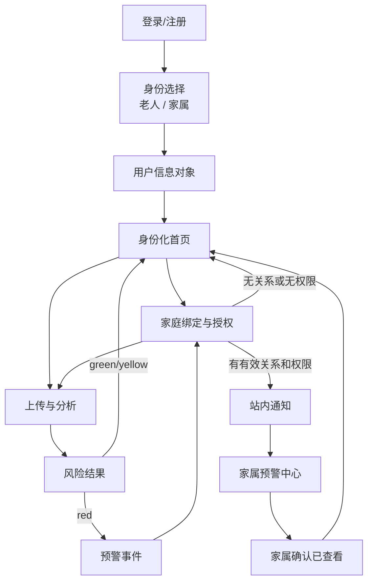

# 银龄安心新增系统介绍与实现文件

> 本文件从《用户任务与需求&信息架构与页面流程》总文件中剥离账户、身份、家庭绑定、用户对象、风险预警和家属通知相关内容，供产品、前端、Coze工作流、数据库、测试和答辩单独使用。
>
> 在线身份只有两种：**老人本人**、**家属/照护者**。医生/药师不设置账户和身份，仅作为老人或家属线下咨询时的沟通对象。

---

## 一、系统划分结论

新增内容采用**两个系统**，而不是把登录、身份选择、家庭绑定和预警分别拆成多个孤立系统。

### 系统一：账户与家庭协同系统

包含：

```text
登录/注册
→ 首次身份选择
→ 用户信息对象
→ 登录态与路由控制
→ 老人生成绑定码
→ 家属提交绑定
→ 老人确认
→ 家庭权限授权
→ 家属代上传和查看获授权内容
```

将这些能力放在同一系统更合理，因为它们共同解决：

- 当前是谁；
- 是老人还是家属；
- 本次材料属于谁；
- 家属与哪位老人存在关系；
- 家属具有什么权限；
- 页面和接口应该返回哪些数据。

### 系统二：风险预警与家属通知系统

包含：

```text
红色风险触发
→ 老人端立即警告
→ 创建预警事件
→ 查询家庭绑定和授权
→ 生成家属简报
→ 创建站内通知
→ 家属查看并确认
→ 老人查看处理状态
```

该系统独立于账户系统，是因为它有单独的触发条件、事件状态、通知记录、失败重试和已读确认机制。

### 不建议拆成三个完全独立系统的原因

不建议把“登录系统”“身份选择系统”“家庭绑定系统”完全分开：

- 身份选择依赖登录后的 `user_id`；
- 家庭绑定依赖老人、家属两种身份；
- 代上传和预警权限依赖家庭关系；
- 分开后容易产生重复用户对象、重复权限判断和路由冲突。

因此，本项目采用：

```text
系统一：账户与家庭协同系统
系统二：风险预警与家属通知系统
```

登录、身份选择和家庭绑定作为系统一中的三个子模块。

---

## 二、总体架构



关键数据关系：

```text
user_account
    │
    └── user_profile
            │
            ├── elder
            │     ├── family_invite
            │     ├── family_relation
            │     ├── material
            │     ├── analysis_result
            │     └── alert_event
            │
            └── family
                  ├── family_relation
                  ├── operation_context
                  └── notification_record
```

---

# 系统一：账户与家庭协同系统

## 三、系统目标

账户与家庭协同系统负责：

1. 识别当前登录用户；
2. 限制身份只能为老人或家属；
3. 保存用户基本资料；
4. 根据身份展示不同首页和功能入口；
5. 建立老人—家属绑定关系；
6. 保存老人授予家属的权限；
7. 区分实际操作人和材料所属老人；
8. 阻止未绑定或未授权的访问；
9. 为预警系统提供家属接收人和权限依据。

---

## 四、用户身份设计

### 4.1 老人本人

可执行：

- 上传本人材料；
- 查看本人药品结果和防骗结果；
- 查看本人历史；
- 生成家庭绑定码；
- 确认或拒绝家属申请；
- 开启或关闭家属权限；
- 查看预警是否已通知家属；
- 解除家庭绑定。

### 4.2 家属/照护者

可执行：

- 登录家属账户；
- 输入老人绑定码；
- 查看本人已绑定老人；
- 在授权后代老人上传材料；
- 在授权后查看家属简报；
- 在授权后接收红色预警；
- 确认已查看预警。

### 4.3 医生/药师

不属于系统身份：

- 不注册；
- 不登录；
- 不进入身份选择页；
- 不拥有医生端；
- 不直接访问老人数据；
- 仅查看老人或家属主动展示、导出或打印的材料。

---

## 五、页面与路由

| 页面 | 路由 | 核心任务 | 中期要求 |
|---|---|---|---|
| 登录/注册页 | `/login` | 登录或创建账户 | 必须完成 |
| 身份选择页 | `/role-select` | 选择老人或家属 | 必须完成 |
| 家庭绑定页 | `/family-bind` | 生成/输入绑定码、确认和授权 | 必须完成基础版 |
| 账户中心 | `/account` | 查看资料、身份、家庭成员和退出 | 尽量完成 |
| 老人首页 | `/` | 上传本人材料、绑定家属、查看预警 | 必须完成 |
| 家属首页 | `/` | 代上传、查看绑定老人和预警 | 必须完成 |
| 无权限页 | `/forbidden`或状态页 | 阻止越权访问 | 必须完成 |

---

## 六、登录/注册页实现

### 6.1 页面结构

```
登录银龄安心
├── 用户名输入框
├── 手机号输入框
├── 验证码输入框
├── 获取验证码按钮
├── 用户协议和隐私说明勾选
├── 主按钮：登录/注册
├── 登录状态提示
└── 隐私说明入口
```

### 6.2 中期登录方案

正式方案：

```text
手机号
→ 发送短信验证码
→ 校验验证码
→ 创建或读取账户
→ 创建会话
```

中期方案：

```text
预置老人测试账户
+ 预置家属测试账户
→ 输入测试密码或固定测试验证码
→ 创建会话
```

建议测试账户：

```text
老人：elder_demo
家属：family_demo
```

注意：

- 测试密码不写进公开文档和公开仓库；
- 固定验证码只在测试环境启用；
- 公开部署前关闭测试后门。

### 6.3 登录流程

```
步骤1：用户输入登录信息
├── 检查手机号/账号格式
├── 检查协议是否勾选
└── 点击登录

步骤2：服务端校验
├── 验证码或测试账号是否正确
├── 查找 user_account
│   ├── 已存在：读取账户
│   └── 不存在：创建账户
└── 创建 user_session

步骤3：判断身份
├── user_role 为空 → /role-select
├── user_role = elder → 老人首页
├── user_role = family → 家属首页
└── 其他值 → 拒绝进入
```

### 6.4 登录状态

| 状态 | 页面表现 |
|---|---|
| 默认 | 输入框和登录按钮正常显示 |
| 验证码发送中 | 按钮倒计时 |
| 登录中 | 禁用重复提交 |
| 登录失败 | 显示具体但不泄露安全细节的提示 |
| 首次登录 | 自动进入身份选择 |
| 已登录 | 访问登录页时跳转首页 |
| 会话失效 | 清除会话并返回登录页 |

---

## 七、身份选择页实现

### 7.1 页面结构

```
请选择您的身份
├── 卡片A：我是老人本人
│   └── 查看自己的材料、结果和家属提醒
├── 卡片B：我是家属/照护者
│   └── 绑定老人后代上传和接收获授权提醒
├── 身份说明
└── 主按钮：确认身份
```

### 7.2 数据规则

```text
允许：elder
允许：family
禁止：doctor
禁止：pharmacist
禁止：medical_staff
禁止：其他前端自定义值
```

### 7.3 处理流程

```
选择身份
→ 前端提交 user_role
→ 服务端白名单校验
→ 写入 user_profile
→ 初始化对应资料
→ 进入对应首页
```

### 7.4 约束

- 首次登录必须选择身份；
- 医生/药师不显示；
- 中期不支持双身份；
- 不允许只修改浏览器参数改变身份；
- 中期可不提供身份修改；
- 后续如支持修改，必须处理已有家庭关系和数据归属。

---

## 八、身份化首页

### 8.1 老人首页

```
老人首页
├── 主按钮：拍照或上传材料
├── 邀请家人绑定
├── 查看历史记录
├── 查看预警状态
├── 账户中心
└── 隐私提醒
```

### 8.2 家属首页

```
家属首页
├── 主按钮：代老人上传材料
├── 选择已绑定老人
├── 查看红色预警
├── 家庭绑定
├── 查看家属简报
├── 账户中心
└── 隐私提醒
```

### 8.3 路由守卫

进入受保护页面前判断：

```text
是否登录？
├── 否 → /login
└── 是
    ├── 是否选择身份？
    │   ├── 否 → /role-select
    │   └── 是
    │       ├── 页面是否允许当前身份？
    │       ├── 家属是否完成绑定？
    │       └── 家属是否拥有具体权限？
```

---

## 九、家庭绑定页实现

### 9.1 老人端

```
邀请家人一起守护
├── 生成6位绑定码
├── 显示有效期倒计时
├── 取消当前绑定码
├── 查看待确认申请
├── 确认/拒绝家属
├── 设置权限
└── 查看已绑定家属
```

### 9.2 家属端

```
绑定一位老人
├── 输入6位绑定码
├── 选择关系
│   ├── 子女
│   ├── 配偶
│   ├── 其他亲属
│   ├── 照护者
│   └── 其他
├── 提交申请
├── 查看等待确认状态
└── 查看已绑定老人
```

### 9.3 完整流程

```
老人生成绑定码
→ 系统创建 family_invite
→ 家属输入绑定码
→ 校验有效性
→ 家属选择关系
→ 创建 pending 的 family_relation
→ 老人确认
→ 老人设置权限
→ relation.status = active
→ 家属获得最小授权
```

### 9.4 建议权限

| 权限 | 默认值 | 说明 |
|---|---:|---|
| receive_red_alert | 关闭 | 接收红色风险预警 |
| view_family_report | 可开启 | 查看家属简报摘要 |
| upload_for_elder | 可开启 | 代老人上传材料 |
| view_history_summary | 关闭 | 查看历史摘要 |
| view_original_image | 关闭 | 查看原始图片 |
| view_financial_details | 关闭 | 查看金额和账户信息 |

### 9.5 绑定码规则

- 6位数字；
- 推荐有效期10分钟；
- 一次性使用；
- 与老人账户绑定；
- 不直接包含手机号或姓名；
- 过期、撤销、使用成功后失效；
- 重复绑定给出明确提示。

### 9.6 解除绑定

```
点击解除绑定
→ 二次确认
→ relation.status = revoked
→ 停止所有后续访问和通知
→ 已打开页面再次请求时返回无权限
→ 保留最小审计记录
```

---

## 十、操作人与材料归属

账户系统必须区分：

```text
operator_user_id：实际操作人
subject_user_id：材料所属老人
```

### 10.1 老人本人上传

```text
operator_user_id = 老人user_id
subject_user_id = 老人user_id
```

### 10.2 家属代上传

```text
operator_user_id = 家属user_id
subject_user_id = 已绑定老人user_id
```

代上传前必须检查：

- 家庭关系有效；
- `upload_for_elder = true`；
- `subject_user_id` 确实属于家属的绑定老人；
- 不允许家属手动输入任意老人ID。

### 10.3 为什么必须区分

不区分会导致：

- 材料错误保存到家属账户；
- 老人历史记录缺失；
- 预警找不到正确家属；
- 家属可能越权查看他人材料；
- 简报和通知关联错误。

---

## 十一、账户与家庭数据对象

### 11.1 `user_account`

```json
{
  "user_id": "usr_xxx",
  "username": "王阿姨",
  "phone": "138****0000",
  "login_type": "sms|test_account",
  "account_status": "active|disabled",
  "created_at": "datetime",
  "last_login_at": "datetime"
}
```

### 11.2 `user_profile`

```json
{
  "user_id": "usr_xxx",
  "user_role": "elder|family",
  "display_name": "王阿姨",
  "birth_year": 1955,
  "profile_completed": true,
  "allow_family_binding": true,
  "created_at": "datetime",
  "updated_at": "datetime"
}
```

### 11.3 `family_invite`

```json
{
  "invite_id": "inv_xxx",
  "elder_user_id": "usr_elder",
  "invite_code": "482615",
  "status": "active|used|expired|cancelled",
  "expires_at": "datetime",
  "used_by_user_id": null,
  "created_at": "datetime"
}
```

### 11.4 `family_relation`

```json
{
  "relation_id": "rel_xxx",
  "elder_user_id": "usr_elder",
  "family_user_id": "usr_family",
  "relation_type": "child|spouse|relative|caregiver|other",
  "status": "pending|active|rejected|revoked",
  "permissions": {
    "receive_red_alert": true,
    "view_family_report": true,
    "upload_for_elder": true,
    "view_history_summary": false,
    "view_original_image": false,
    "view_financial_details": false
  },
  "requested_at": "datetime",
  "confirmed_at": "datetime",
  "revoked_at": null
}
```

### 11.5 `operation_context`

```json
{
  "operator_user_id": "usr_family",
  "subject_user_id": "usr_elder",
  "operator_role": "family",
  "relation_id": "rel_xxx",
  "operation_type": "upload|view_report|view_history|view_alert",
  "permission_checked": true
}
```

### 11.6 `user_session`

```json
{
  "session_id": "ses_xxx",
  "user_id": "usr_xxx",
  "expires_at": "datetime",
  "status": "active|expired|revoked",
  "created_at": "datetime"
}
```

---

## 十二、账户与家庭接口建议

| 接口 | 方法 | 输入 | 输出 |
|---|---|---|---|
| `/api/auth/login` | POST | 用户名、手机号、验证码或测试密码、协议勾选状态 | session、user（含username）、role_status |
| `/api/auth/logout` | POST | session | 成功状态 |
| `/api/profile/role` | POST | user_role | user_profile |
| `/api/profile/me` | GET | session | 当前用户资料 |
| `/api/family/invite` | POST | elder_user_id | invite_code、expires_at |
| `/api/family/bind` | POST | invite_code、relation_type | pending relation |
| `/api/family/confirm` | POST | relation_id、permissions | active relation |
| `/api/family/reject` | POST | relation_id | rejected relation |
| `/api/family/revoke` | POST | relation_id | revoked relation |
| `/api/family/list` | GET | session | 已绑定成员 |
| `/api/family/permission` | PATCH | relation_id、permissions | 更新后权限 |
| `/api/family/check-access` | POST | subject_user_id、action | allowed/denied |

返回接口时不直接暴露：

- 完整手机号；
- 明文绑定码历史；
- 会话令牌日志；
- 无权限老人的存在性和资料。

---

## 十三、账户系统错误码

```text
AUTH_INVALID_CREDENTIALS
AUTH_SESSION_EXPIRED
AUTH_ROLE_REQUIRED
AUTH_ROLE_INVALID
FAMILY_INVITE_INVALID
FAMILY_INVITE_EXPIRED
FAMILY_INVITE_USED
FAMILY_RELATION_EXISTS
FAMILY_CONFIRM_REQUIRED
FAMILY_PERMISSION_DENIED
FAMILY_RELATION_REVOKED
SUBJECT_USER_INVALID
```

前端提示示例：

| 错误码 | 用户提示 |
|---|---|
| AUTH_INVALID_CREDENTIALS | 登录信息不正确，请重新输入 |
| AUTH_SESSION_EXPIRED | 登录已失效，请重新登录 |
| AUTH_ROLE_REQUIRED | 请先选择老人或家属身份 |
| FAMILY_INVITE_EXPIRED | 绑定码已过期，请让老人重新生成 |
| FAMILY_RELATION_EXISTS | 你们已经绑定，无需重复操作 |
| FAMILY_CONFIRM_REQUIRED | 等待老人确认后即可使用 |
| FAMILY_PERMISSION_DENIED | 你暂时没有查看此内容的权限 |
| SUBJECT_USER_INVALID | 无法选择该老人，请检查绑定关系 |

---

# 系统二：风险预警与家属通知系统

## 十四、系统目标

风险预警与家属通知系统负责：

1. 接收药品或防骗工作流输出的风险等级；
2. 红色风险立即在老人端置顶展示；
3. 创建可追踪的预警事件；
4. 判断是否存在已绑定且已授权家属；
5. 生成家属简报；
6. 创建站内通知；
7. 记录发送、已读和确认状态；
8. 通知失败时允许重试；
9. 让老人看到家属是否已知晓；
10. 保证未授权时不对外发送敏感信息。

---

## 十五、预警触发规则

### 15.1 绿色

- 暂未发现明显风险；
- 不自动创建家属预警；
- 用户可主动生成简报。

### 15.2 黄色

- 产品身份不清；
- 宣传模糊或存在夸大；
- 批准文号暂未核验成功；
- 不自动创建家属预警；
- 建议用户主动询问家属、医生或药师。

### 15.3 红色

可触发：

- 索要验证码；
- 要求私人转账；
- 诱导停药；
- 冒充官方或医生；
- 威胁恐吓；
- 不让告诉子女；
- 批准文号对应其他药品；
- 产品名称、厂家、规格严重不一致。

红色风险仍必须遵守：

- 每条风险提供原文证据；
- 不只根据一个关键词判断；
- 不无证据判定诈骗；
- 不直接认定违法；
- 不使用恐吓语言。

---

## 十六、老人端红色警告

红色结果第一屏固定显示：

```text
发现高风险信息
├── 先别付款
├── 不要提供验证码
├── 不要点击陌生链接
├── 不要停掉现在吃的药
└── 请立即联系可信家人
```

约束：

- 不可折叠；
- 不能只显示红色，需要图标和文字；
- 不依赖网络通知是否成功；
- 不依赖是否绑定家属；
- 即使预警数据库写入失败，老人端也必须显示风险结果。

---

## 十七、预警处理流程

```
风险工作流输出 risk_level
├── green → 正常结果
├── yellow → 正常结果 + 主动生成简报入口
└── red
    ├── 老人端立即显示红色警告
    ├── 创建 alert_event
    ├── 生成家属简报
    ├── 查询 family_relation
    ├── 筛选 receive_red_alert = true
    │   ├── 无接收人
    │   │   ├── alert.status = no_recipient
    │   │   ├── 提示老人尚未通知家属
    │   │   └── 提供绑定和手动分享
    │   └── 有接收人
    │       ├── 创建 notification_record
    │       ├── 发送站内提醒
    │       ├── 家属查看
    │       ├── 标记read
    │       ├── 家属点击我已查看
    │       └── 标记acknowledged
    └── 老人端显示通知处理状态
```

---

## 十八、预警中心页面

### 18.1 家属端 `/alerts`

```
预警中心
├── 未读预警数量
├── 预警列表
│   ├── 老人称呼
│   ├── 红色风险标识
│   ├── 材料类型
│   ├── 发生时间
│   ├── 一句话摘要
│   └── 未读/已读/已确认
├── 预警详情
│   ├── 立即行动
│   ├── 最多3条原文证据
│   ├── 家属简报
│   ├── 是否付款/停药/泄露信息
│   └── 建议家属行动
└── 主按钮：我已查看
```

### 18.2 老人端预警状态

```
预警状态
├── 尚未绑定家属
├── 已绑定但未开启预警权限
├── 提醒发送失败
├── 已发送，等待家属查看
├── 家属已查看
└── 家属已确认知晓
```

---

## 十九、家属简报与预警的关系

家属简报是内容载体，预警是事件和通知机制。

```text
alert_event
→ 关联 family_report
→ 创建 notification_record
→ 家属点击通知
→ 打开 family_report
```

红色风险：

- 自动生成简报；
- 自动创建预警事件；
- 只有已授权家属收到站内提醒。

绿色/黄色风险：

- 不自动通知；
- 用户主动生成和转发简报。

---

## 二十、预警数据对象

### 20.1 `alert_event`

```json
{
  "alert_id": "alt_xxx",
  "subject_user_id": "usr_elder",
  "material_id": "mat_xxx",
  "analysis_id": "ana_xxx",
  "family_report_id": "rep_xxx",
  "risk_level": "red",
  "risk_categories": ["transaction", "treatment_replacement"],
  "evidence": [
    {
      "quote": "今天必须转账，不要告诉子女",
      "source": "材料1-聊天截图"
    }
  ],
  "stop_actions": ["先别付款", "不要提供验证码", "不要停掉现在吃的药"],
  "status": "created|no_recipient|notifying|notified|partially_failed|closed",
  "created_at": "datetime"
}
```

### 20.2 `notification_record`

```json
{
  "notification_id": "not_xxx",
  "alert_id": "alt_xxx",
  "recipient_user_id": "usr_family",
  "channel": "in_app",
  "status": "pending|sent|failed|read|acknowledged",
  "sent_at": "datetime",
  "read_at": null,
  "acknowledged_at": null,
  "failure_reason": null,
  "retry_count": 0
}
```

### 20.3 分析对象补充

```json
{
  "analysis_id": "ana_xxx",
  "material_id": "mat_xxx",
  "subject_user_id": "usr_elder",
  "risk_level": "red",
  "alert_triggered": true,
  "alert_id": "alt_xxx",
  "created_at": "datetime"
}
```

### 20.4 家属简报对象补充

```json
{
  "family_report_id": "rep_xxx",
  "subject_user_id": "usr_elder",
  "source_analysis_ids": ["ana_xxx"],
  "highest_risk_level": "red",
  "sensitive_fields_included": [],
  "generated_by": "system_red_alert",
  "created_at": "datetime"
}
```

---

## 二十一、预警工作流建议

```text
WF-ALERT-01 接收风险结果
输入：analysis_id、subject_user_id、risk_level、evidence
→ 判断risk_level
→ 非红色直接结束
→ 红色进入预警

WF-ALERT-02 创建预警事件
→ 检查analysis_id是否已有alert
→ 无：创建alert_event
→ 有：复用已有alert_id，防止重复

WF-ALERT-03 生成家属简报
→ 组合材料摘要、风险证据、行动建议
→ 按权限脱敏
→ 创建family_report

WF-ALERT-04 查询接收人
→ 查询active的family_relation
→ 检查receive_red_alert
→ 输出recipient_user_ids

WF-ALERT-05 创建站内通知
→ 为每位接收人创建notification_record
→ status=pending
→ 写入站内通知列表
→ status=sent

WF-ALERT-06 已读与确认
→ 打开详情：status=read
→ 点击我已查看：status=acknowledged
→ 更新老人端状态
```

---

## 二十二、通知渠道选择

### 中期推荐：站内提醒

优点：

- 不需要外部服务商；
- 不需要短信模板资质；
- 可记录发送、已读、确认；
- 容易在答辩现场稳定演示；
- 不泄露信息给未授权外部渠道。

局限：

- 家属需要打开网页；
- 不能完全替代实时短信或微信通知。

### 中期后扩展顺序

1. 微信公众号/小程序订阅消息；
2. 短信；
3. 邮件；
4. 电话外呼。

不建议中期直接承诺已经实现外部自动推送，除非：

- 接口真实接通；
- 模板已审核；
- 用户已授权；
- 有发送记录和失败处理；
- 演示环境可以稳定调用。

---

## 二十三、预警接口建议

| 接口 | 方法 | 输入 | 输出 |
|---|---|---|---|
| `/api/alerts/trigger` | POST | analysis_id、risk_result | alert_id、recipient_count |
| `/api/alerts/list` | GET | session、subject筛选 | 预警列表 |
| `/api/alerts/detail` | GET | alert_id | 预警详情 |
| `/api/alerts/read` | POST | notification_id | read状态 |
| `/api/alerts/acknowledge` | POST | notification_id | acknowledged状态 |
| `/api/alerts/retry` | POST | notification_id | 重试状态 |
| `/api/alerts/status` | GET | alert_id | 各接收人发送/查看状态 |

后端必须检查：

- 当前用户是否为通知接收人；
- 家庭关系是否仍有效；
- 预警权限是否仍开启；
- 简报中敏感字段是否允许显示。

---

## 二十四、预警错误码

```text
ALERT_CREATE_FAILED
ALERT_ALREADY_EXISTS
ALERT_NO_RECIPIENT
ALERT_PERMISSION_DISABLED
ALERT_NOTIFICATION_FAILED
ALERT_NOTIFICATION_NOT_FOUND
ALERT_ACCESS_DENIED
ALERT_ALREADY_ACKNOWLEDGED
```

前端提示示例：

| 错误码 | 用户提示 |
|---|---|
| ALERT_CREATE_FAILED | 家属提醒暂未创建，请先按页面提示停止危险操作 |
| ALERT_NO_RECIPIENT | 尚未通知家属，请立即联系可信家人 |
| ALERT_PERMISSION_DISABLED | 家属预警权限未开启 |
| ALERT_NOTIFICATION_FAILED | 提醒发送失败，可重试或手动分享简报 |
| ALERT_ACCESS_DENIED | 你没有查看这条预警的权限 |
| ALERT_ALREADY_ACKNOWLEDGED | 该预警已确认，无需重复操作 |

---

## 二十五、隐私与安全规则

### 25.1 家庭关系

- 绑定码不能直接开放老人数据；
- 家属提交后仍需老人确认；
- 未确认关系不拥有权限；
- 解除绑定后立即停止访问和通知。

### 25.2 敏感字段

分别授权：

- 上传原图；
- 付款金额；
- 付款账户；
- 身份证信息；
- 银行卡信息；
- 历史记录详情。

### 25.3 预警

- 红色风险自动创建预警事件；
- 自动创建事件不等于自动对外泄露数据；
- 只有已绑定且授权家属收到提醒；
- 外部渠道必须再次获得明确授权；
- 通知失败不能隐藏老人端风险。

### 25.4 日志

不得记录：

- 明文验证码；
- 明文测试密码；
- 完整手机号；
- 完整银行卡号；
- 会话令牌；
- 未脱敏身份证号。

---

## 二十六、中期检查范围

### 26.1 必须跑通

```text
老人登录
→ 老人身份
→ 生成绑定码
→ 家属登录
→ 家属身份
→ 输入绑定码
→ 老人确认和授权
→ 上传高风险材料
→ 红色风险结果
→ 创建预警事件
→ 家属站内提醒
→ 家属查看并确认
→ 老人看到确认状态
```

### 26.2 必须完成

| 模块 | 内容 |
|---|---|
| 登录 | 老人、家属两个测试账户 |
| 身份 | 只有老人、家属 |
| 用户对象 | account、profile、session |
| 家庭绑定 | 邀请码、申请、确认、关系 |
| 权限 | 红色预警、家属简报、代上传 |
| 归属 | operator_user_id、subject_user_id |
| 预警 | alert_event |
| 通知 | 站内notification_record |
| 状态 | 未读、已读、已确认 |
| 异常 | 登录失败、过期码、无权限、无接收人、通知失败 |
| 隐私 | 授权说明和敏感字段脱敏 |

### 26.3 尽量完成

- 账户中心；
- 解除绑定；
- 通知失败重试；
- 多老人切换；
- 绑定二维码；
- 历史摘要权限；
- 手机端完整适配。

### 26.4 暂不完成

- 医生/药师账户；
- 双身份；
- 真实短信验证码；
- 短信、邮件、公众号预警；
- 自动电话；
- 实名认证；
- 复杂家庭管理员；
- 监护证明上传。

---

## 二十七、四人实现分工

### 成员A：产品/UI/前端

- 登录页；
- 身份选择页；
- 家庭绑定页；
- 预警中心；
- 老人/家属首页差异；
- 权限开关；
- 无权限、空状态、失败状态；
- 移动端适配；
- 前端路由守卫。

### 成员B：知识库/内容

- 红色风险规则；
- 风险证据模板；
- 老人端立即行动文案；
- 家属端行动建议；
- 敏感字段展示边界；
- 高风险测试样本；
- 标准答案。

### 成员C：Coze/数据/接口

- 账户对象；
- 会话；
- 身份保存；
- 家庭绑定；
- 权限校验；
- 操作人和所属老人；
- 预警事件；
- 通知记录；
- 页面接口；
- 错误码。

### 成员D：测试/部署/答辩

- 登录测试；
- 身份非法值测试；
- 绑定码测试；
- 越权测试；
- 解除绑定测试；
- 红色预警全链路；
- 无家属和无授权测试；
- 通知失败测试；
- 中期演示脚本；
- 截图和备用视频。

---

## 二十八、测试用例重点

| 编号 | 场景 | 期望结果 |
|---|---|---|
| ACC-01 | 老人首次登录 | 进入身份选择 |
| ACC-02 | 身份提交doctor | 服务端拒绝 |
| ACC-03 | 家属未绑定访问老人历史 | 无权限 |
| BIND-01 | 正确绑定码 | 创建待确认关系 |
| BIND-02 | 过期绑定码 | 提示重新生成 |
| BIND-03 | 重复绑定 | 不创建重复关系 |
| BIND-04 | 老人拒绝 | 家属无数据权限 |
| BIND-05 | 解除绑定后访问 | 立即无权限 |
| UPLOAD-01 | 家属获授权代上传 | 记录归属老人 |
| UPLOAD-02 | 家属无代上传权限 | 拒绝上传 |
| ALERT-01 | 绿色风险 | 不自动创建预警 |
| ALERT-02 | 黄色风险 | 不自动通知 |
| ALERT-03 | 红色+已授权家属 | 创建站内提醒 |
| ALERT-04 | 红色+无家属 | 老人端提示手动联系 |
| ALERT-05 | 红色+权限关闭 | 不通知家属 |
| ALERT-06 | 通知失败 | 保留预警并允许重试 |
| ALERT-07 | 家属查看 | 状态变为read |
| ALERT-08 | 家属确认 | 状态变为acknowledged |
| PRIV-01 | 无原图权限 | 简报不返回原图 |
| PRIV-02 | 无财务权限 | 金额和账户脱敏 |

---

## 二十九、中期演示脚本

```
1. 使用老人测试账户登录
2. 选择“我是老人本人”
3. 进入家庭绑定页生成6位绑定码
4. 使用家属测试账户登录
5. 选择“我是家属/照护者”
6. 输入绑定码并选择“子女”
7. 返回老人端确认绑定
8. 开启红色预警、家属简报和代上传权限
9. 上传包含“停药、私人转账、不要告诉子女”的聊天截图
10. 完成分类确认
11. 展示红色风险、原文证据和立即行动
12. 展示预警事件已创建
13. 家属端预警中心出现未读提醒
14. 打开家属简报
15. 点击“我已查看”
16. 老人端显示“家属已确认知晓”
17. 关闭预警权限后再次演示“不发送”的权限控制
```

---

## 三十、验收底线

- 身份选择只有老人和家属；
- 医生/药师没有系统账号；
- 登录状态可以保持并安全退出；
- 家庭绑定必须经过老人确认；
- 家属权限可控；
- 家属不能越权访问其他老人；
- 家属代上传的数据归属正确；
- 红色风险先在老人端显示；
- 红色风险有原文证据；
- 预警事件和通知记录分开保存；
- 未绑定或未授权不发送；
- 通知失败不影响老人端警告；
- 家属可以标记已查看和已确认；
- 至少完成一条全链路演示；
- 中期不虚假宣称已接入短信、邮件或公众号。

---
