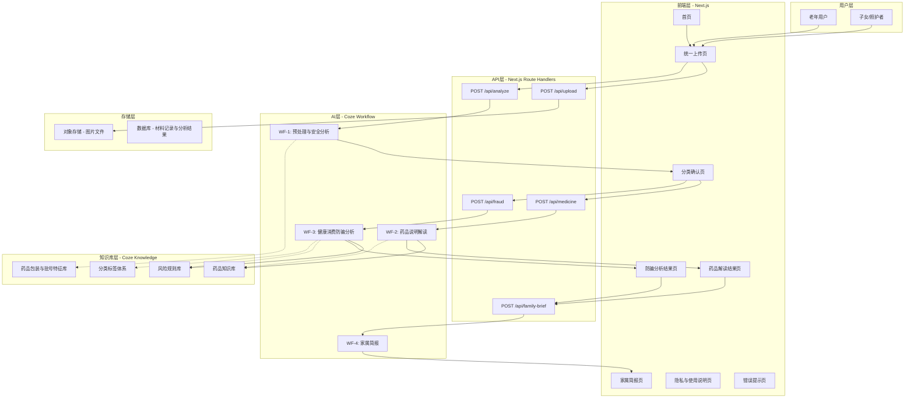

# 银龄安心 - 技术架构文档

## 一、项目概述

银龄安心是一款面向老年人及其家属的用药解读与健康消费防骗 AI Agent。用户上传药盒、药品说明书、医院处方、保健品宣传、聊天记录等材料图片，系统通过 AI 工作流自动判断材料类型，进入药品解读或健康消费防骗分析流程，并生成家属简报和问医生清单。

**技术路线**：Next.js 前端 + Coze AI Agent + Coze Workflow + 知识库 RAG

---

## 二、项目整体架构



---

## 三、数据流

### 3.1 核心数据流

```
用户上传图片
    │
    ▼
前端上传页（本地预览）
    │
    ▼
POST /api/upload → 对象存储 → 返回 file_url
    │
    ▼
POST /api/analyze → WF-1 材料预处理与安全分析 → 返回 Material 对象
    │  含：OCR + 视觉理解 + 分类 + 隐私检测 + 仿冒药初筛
    │
    ▼
分类确认页（用户确认或修正材料类型）
    │
    ├─ route=medicine ──→ POST /api/medicine → WF-2 → 药品解读结果页
    │
    ├─ route=fraud ────→ POST /api/fraud → WF-3 → 防骗分析结果页
    │
    └─ route=manual_confirm ──→ 停留在确认页，用户手动选择
    │
    ▼
POST /api/family-brief → WF-4 → 家属简报页
```

### 3.2 Workflow 间数据传递

```
WF-1 输出 Material ──→ WF-2 输入（药品类材料）
                   ──→ WF-3 输入（防骗类材料）

WF-2 输出 Medicine ──→ 药品结果页展示
                   ──→ WF-4 输入（可选）

WF-3 输出 Risk ──→ 防骗结果页展示
               ──→ WF-4 输入（可选）

WF-4 输出 FamilyBrief ──→ 家属简报页展示
```

**关键原则**：Workflow 之间不直接调用，由 Next.js API 层负责串联。用户确认分类是必须的交互断点，Workflow 无法自行跳过。

---

## 四、AI Agent 模块组成

| 模块 | 类型 | 职责 | 当前状态 |
|------|------|------|---------|
| WF-1 材料预处理与安全分析 | Coze Workflow | 文件校验、清晰度评估、OCR 文字提取、图片内容理解、材料分类、隐私信息检测、仿冒药初筛、路由决策 | 设计完成，待搭建 |
| WF-2 药品说明解读 | Coze Workflow | 药品字段提取、知识库查询、仿冒药深度核验、来源标注、注意事项整理、确认问题生成 | 设计阶段 |
| WF-3 健康消费防骗分析 | Coze Workflow | 四维风险扫描（身份/宣传/交易/情绪）、风险等级判定、行动建议生成 | 设计阶段 |
| WF-4 家属简报 | Coze Workflow | 汇总药品/防骗结果、财务与信息安全提取、行动建议生成 | 设计阶段 |
| 药品知识库 | Coze Knowledge | 药品通用名/适应症/不良反应/禁忌/储存/分类 | 待 B 提供 |
| 风险规则库 | Coze Knowledge | 典型骗术话术模式、风险判定规则、核查建议模板 | 待 B 提供 |
| 分类标签体系 | Coze Knowledge | 11 种材料类型定义、特征描述、边界判定规则 | 待 B 提供 |

---

## 五、P0/P1 功能对应关系

### P0 - 必须完成（中期核心）

| 功能模块 | 对应页面 | 对应 Workflow | 对应知识库 | 当前状态 |
|---------|---------|--------------|-----------|---------|
| 统一上传与分类 | upload、confirm | WF-1 | 分类标签体系 | 前端骨架完成，Workflow 待搭建 |
| 大字版药品说明 | medicine | WF-2 | 药品知识库 | 前端骨架完成，Workflow 设计阶段 |
| 仿冒药/假药初筛 | confirm（警示）、medicine（深度核验） | WF-1（初筛）+ WF-2（深度核验） | 药品知识库（批准文号比对） | 数据结构已定义，Workflow 设计阶段 |
| 健康消费防骗分析 | fraud | WF-3 | 风险规则库 | 前端骨架完成，Workflow 设计阶段 |
| 隐私信息检测 | upload（确认弹窗） | WF-1（检测节点） | 无 | 数据结构已定义，Workflow 设计阶段 |
| 三级风险机制 | fraud、medicine | WF-3（判定）、WF-2（标注） | 风险规则库 | 规则已定义，Workflow 设计阶段 |
| 错误处理 | error | WF-1（校验节点） | 无 | 前端骨架完成，错误码体系待完善 |

### P1 - 尽量完成

| 功能模块 | 对应页面 | 对应 Workflow | 对应知识库 | 当前状态 |
|---------|---------|--------------|-----------|---------|
| 家属简报 | family | WF-4 | 无 | 前端骨架完成，Workflow 设计阶段 |

### P2 - 中期后迭代

| 功能模块 | 对应页面 | 对应 Workflow | 当前状态 |
|---------|---------|--------------|---------|
| 多药整理 | multi-medicine | 待设计 | 前端未创建 |
| 药品与保健品对照 | comparison | 待设计 | 前端骨架完成（mock） |
| 问医生清单 | doctor | 待设计 | 前端骨架完成（mock） |
| 证据整理 | evidence | 待设计 | 前端骨架完成（mock） |
| 历史记录 | history | 待设计 | 前端骨架完成（mock） |
| 语音播报 | - | 待设计 | 未开始 |

---

## 六、当前阶段完成情况

| 层级 | 完成项 | 未完成项 |
|------|--------|---------|
| **前端层** | 12 个页面骨架全部完成；适老化设计规范落地；模拟数据可展示；页面间跳转可用 | 未接入真实 API；未传递实际数据；所有结果页使用 mock 数据 |
| **API 层** | 无 | 全部 5 个 API 路由待创建（upload、analyze、medicine、fraud、family-brief） |
| **Workflow 层** | WF-1 节点设计完成（9 节点 + 2 错误出口，含隐私检测+仿冒药初筛）；数据对象协议定义完成（含 authenticity_flags + sensitive_info_detected） | WF-1 待在 Coze 中搭建；WF-2/WF-3/WF-4 仅有架构设计，节点待设计 |
| **知识库层** | 分类标签体系（11 种类型）已定义；仿冒药初筛规则已定义（批准文号格式+包装特征） | 药品知识库待 B 提供（含批准文号库）；风险规则库待 B 提供 |
| **存储层** | 无 | 对象存储配置待完成；数据库建表待完成 |
| **设计规范** | DESIGN.md 已完成（配色、字体、布局、组件规范）；AGENTS.md 已完成 | - |

---

## 七、技术栈

| 组件 | 技术选型 | 版本 |
|------|---------|------|
| 前端框架 | Next.js (App Router) | 16 |
| UI 框架 | React | 19 |
| 语言 | TypeScript | 5 |
| UI 组件库 | shadcn/ui (Radix UI) | - |
| 样式 | Tailwind CSS | 4 |
| AI 工作流 | Coze Workflow | - |
| AI 知识库 | Coze Knowledge (RAG) | - |
| 包管理器 | pnpm | - |
